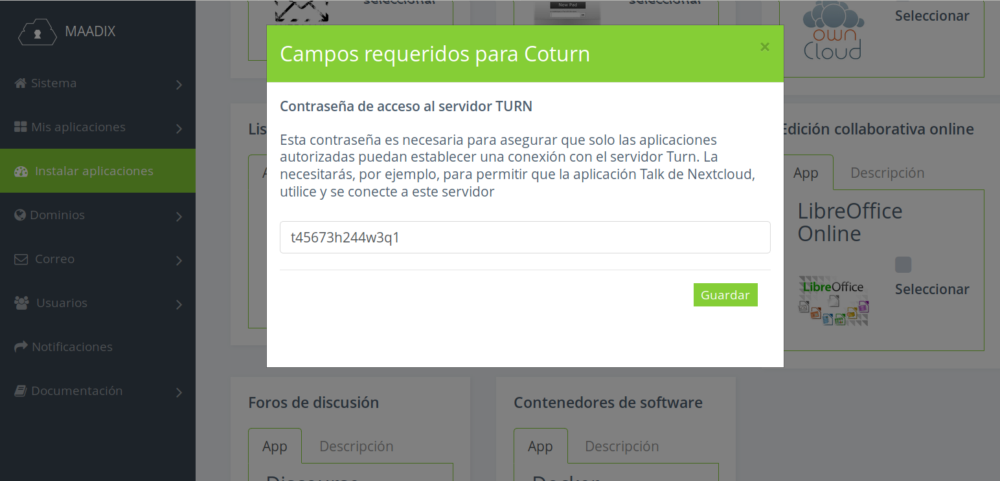

# Servidor TURN

Los servidores TURN se utilizan para retransmitir el tráfico si falla la conexión directa entre dos dispositivos (peer to peer).  

Gracias a [WebRTC](https://webrtc.org/) los navegadores son capaces de efectuar conexiones directas entre dispositivos, compartiendo recursos como audio, vídeo o pantalla. De esta forma podemos llevar a cabo vídeo llamadas simplemente compartiendo un enlace y accediendo a él desde el navegador, sin necesidad de software adicional. Este tipo de conexión establece una comunicación directa entre las personas que se unen a la llamada.  

Sin embargo, en algunos casos, dependiendo de la configuración de red desde la que se conectan los dispositivos, puede ser imposible para los navegadores establecer la conexión directa con los otros pares.  

Para solucionar estos problemas se puede activar un servidor TURN, capaz de resolver las posibles incompatibilidades y permitir que cualquier dispositivo pueda unirse a las llamadas desde el navegador.  
Activar un servidor TURN tiene como consecuencia un consumo más alto del ancho de banda y un aumento de la latencia. Sin embargo, en algunos casos, se convierte en la única solución eficaz para garantizar conexiones exitosas con todos los dispositivos.  

La aplicación Talk de NextCloud, que permite crear salas de vídeo conferencias tanto públicas como privadas, puede generar estas circunstancias de error.

Como solución hemos añadido la opción de instalar desde el panel de control un servidor TURN.  

Si quieres saber más sobre el funcionamiento de conexione WebRTC + TURN consulta este enlace:
[https://www.html5rocks.com/en/tutorials/webrtc/infrastructure/](https://www.html5rocks.com/en/tutorials/webrtc/infrastructure/)  

## Instalación  

Encontrarás la opción de instalación en la página 'Instalar Aplicaciones' del menú izquierdo del panel de control.  
Al hacer clic en 'Servidor TURN', se abrirá una ventana emergente, en la que tendrás que insertar una contraseña. Esta contraseña es necesaria para conectar la aplicación Talk al servidor TURN.  

  

Una vez completada la instalación, recibirás un correo electrónico con los datos necesarios para activar la conexión entre la aplicación Talk y el servidor TURN.
La contraseña no está incluida en el correo, y la podrás volver a consultar o modificar desde el mismo panel de control, en la pestaña MIs Aplicacione -> Servidor Turn, del menú izquierdo. 

## Conectar Talk a TURN 

Una vez terminado el proceso de instalación de TURN, es necesario instalar y configurar la extensión Talk desde Nextcloud. Si todavía no la tienes activada, puedes hacerlo desde el interfaz de Nextcloud visitando la sección Apps -> Multimedia, como administrador.

Una vez activada, tendrás que ir a Configuración -> Talk ('Hablar' si tienes el interfaz en castellano) e insertar, en al apartado 'TURN Server', los valores que has recibido por correo electrónico. 

En el caso de que no puedas acceder al correo que recibiste, los valores son los siguientes:  

- Dirección del servidor Turn:  
nombre.del.servidor:5349   

- Contraseña (TURN server shared secret):
Es la contraseña que elegiste al instalar la aplicación, y que puedes volver a consultar o modificar desde el panel de control, en la pestaña Mis Aplicaciones -> Servidor Turn, del menú izquierdo

- Protocolo:
TCP only
