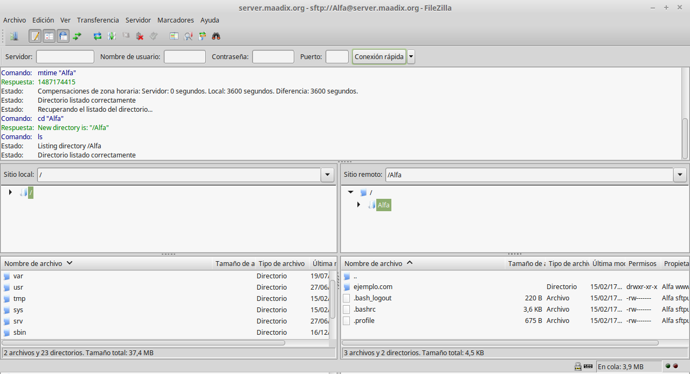

# Crea tu web o aplicación

## Elige tu dominio

Para poder crear un sitio web accesible desde cualquier navegador, necesitarás un dominio o subdominio. 

Si ya tienes un dominio propio, MaadiX te permite activarlo fácilmente y configurarlo para usarlo luego en tu página web y aplicaciones. Si todavía no has activado tu dominio en MaadiX, puedes encontrar las instrucciones sobre cómo proceder en el [siguiente tutorial](dominios.md).

Alternativamente, si no dispones de un dominio propio, puedes usar tu *subdominio.maadix.org*, donde 'subdominio' coincide con el nombre que elegiste al adquirir tu servidor MaadiX. Deberás crear tu web o aplicación dentro de la carpeta `/var/www/html/subdominio.maadix.org`, y podrás visitarlo desde el navegador en tu *subdominio.maadix.org*.

En el siguiente tutorial se describen los pasos a seguir en caso de estar en posesión de un dominio propio. No obstante, el proceso es el mismo para usarlo en tu *subdominio.maadix.org* si se tiene en cuenta la información anterior.

## Subir contenidos

Una vez tengas [activado el dominio](dominios.md) para tu nuevo sitio web, tendrás que subir los archivos de tu aplicación a la carpeta que se encuentra en `/var/www/html/midominio.com`.   

Puedes acceder a esta ubicación y subir los archivos fácilmente utilizando un cliente SFTP (Secure File Transfer Protocol). En caso de que no tengas ningún cliente SFTP instalado y no supieras cual escoger, [Filezilla](https://filezilla-project.org/) es uno de los más usados y sencillos.

Como es natural, el cliente SFTP te pedirá una serie de credenciales para conectar con el servidor:

#### Como usuario Webmaster  

Si al activar tu dominio le has asignado un usuario Webmaster específico (lo cual recomendamos), éste será el propietario de la carpeta `/var/www/html/midominio.com`, de manera que sólo él podrá modificar los archivos que se encuentran en ella.

Las credenciales para la conexión con el usuario Webmaster son:

* **Servidor**: tu *subdomino.maadix.org*
* **Protocolo**: SFTP  
* **Modo de acceso**: Normal  
* **Usuario**: El nombre del usuario Webmaster (Advertencia: Sensible a mayúsculas y minúsculas)
* **Contraseña**: La contraseña que has establecido para este usuario

Cuando se establezca la conexión, el usuario Webmaster verá una carpeta con su nombre. En ella, encontrará una carpeta que le da acceso a `/var/www/html/midominio.com`, o varias si es Webmaster de otros dominios aparte de este.

También puede tener ahí otros archivos propios que haya subido o creado anteriormente. Los usuarios Webmaster sólo tienen acceso a esta zona y no a todos los archivos del sistema (como sí tiene el Superusuario). 

#### Dentro de la carpeta `/var/www/html/midominio.com` 

Dentro de la carpeta `/var/www/html/midominio.com` hay dos elementos: Una carpeta con nombre .well-known y un archivo index.html.  

La carpeta .well-known es necesaria para efectuar una conexión segura a la web (HTTPS) y no debes tocarla (*si no puedes ver la carpeta .well-known, no te preocupes. El punto delante del nombre significa que es un archivo oculto, está ahí pero Filezilla, o tu cliente SFTP están configurados para no mostrar los archivos ocultos*).  

El archivo index.html es un archivo tipo *placeholder* que se crea en el proceso de activación del dominio y que sirve para comprobar que la activación del dominio se ha completado con éxito. Si visitas desde un navegador tu dominio antes de haber subido tus propios archivos, encontrarás la página de bienvenida de este archivo index.html.  

[Screenshot de la bienvenida]

Así pues, puedes ahora borrar (o sobrescribir) este archivo index.html existente y **subir aquí los archivos de tu web o aplicación**. 

# Como Superusuario de sistema 

Si no has creado ningún usuario webmaster para tu nuevo dominio, el propietario de la carpeta web en `/var/www/html/midominio.com` será tu Superusuario de sistema.

Puedes establecer connexión por SFTP como tu Superusuario con las credenciales:

* **Servidor**: tu *subdomino.maadix.org*
* **Protocolo**: SFTP 
* **Modo de acceso**: Normal  
* **Usuario**: El nombre del Superusuario (Advertencia: Sensible a mayúsculas y minúsculas)
* **Contraseña**: La contraseña del Superusuario

Si no recuerdas tus datos de Superusuario, puedes consultarlos en la pestaña **'Usuarios'** de tu panel de control -- es el primero que aparece en la lista. También puedes restablecer allí su contraseña en caso de que la hubieras olvidado.

El Superusuario tiene altos privilegios y acceso a todo el sistema. Cuando estableces la conexión SFTP al servidor como Superusuario, la ubicación en la que te encuentras al inicio de sesión es la carpeta personal en `/home/superusuario/`.

Tendrás que navegar a través de las carpetas hasta llegar a `/var/www/html/midominio.com/`, que es donde tendrás que subir o crear los archivos de tu nueva web o aplicación. Otra opción más rápida es escribir la ruta `/var/www/html/midominio.com/` en el campo "Sitio remoto".

Una vez ahí, puedes seguir los mismos pasos descritos para el usuario [Webmaster](#domain-folder)

