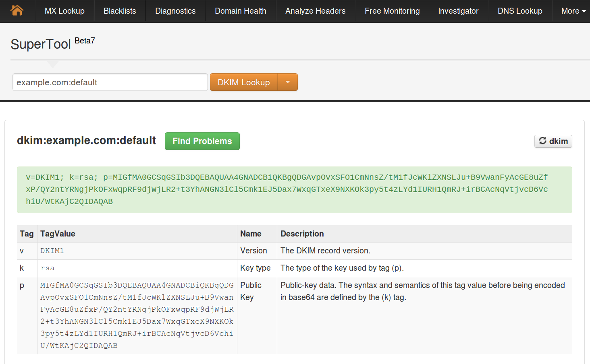

# DNS

Cuando registramos un dominio, existe un apartado en su configuración llamado DNS. Los DNS son los que pemiten transformar nombres de dominio entendibles por humanos en números que corresponden a las diferentes máquinas conectadas y accesibles públicamente en Internet. Hay diferentes tipos de contenidos que un servidor puede mostrar. Entre ellos, los más comunes son sitios web y correo. Para que estos servicios funcionen correctamente y desde cualquier ubicación utilizando nombres en lugar que números, es necesario comunicar públicamente la máquina en la que están alojados los servicios. Esta comunicación se lleva a cabo configurando correctamente los registros DNS.  

Los registros DNS se configuran desde la interfaz proporcionada por tu proveedor de dominio. Esto significa que puede haber pequeñas diferencias en la sintaxis requerida por cada uno. En este tutorial hemos intentado cubrir todas las posibles opciones.

# Páginas web

## Registro de tipo A

Para que una página web esté disponible visitando tu dominio desde un navegador, es necesario que el valor del registro A de los DNS del dominio sea el mismo que la IP de tu servidor.  

En esta tabla se muestra cómo configurar los registros de tipo A para el dominio example.com y para el subdominio subdomain.example.com.  
En la primera línea de la tabla, dentro de la columna 'Name', se ha utilizado el carácter '@', que representa el nombre del dominio.   

En la segunda línea estamos especificando en la columna 'Name' el nombre del subdominio. Como puedes ver, no es necesario especificar el valor del dominio, por lo que usaremos 'subdomain' en lugar de 'subdomain.example.com'. 

La columna 'Value' se refiere a la IP. Tendrás que sustituir este valor de ejemplo  con la IP de tu servidor. Puedes encontrar este valor en el panel de control: entra en la pestaña '**Dominios**' y haz clic en el enlace '**Ver**' de la columna DNS correspondiente al dominio que quieres configurar.

Type         | Name          | Value
------------ | ------------- | ------------
A            | @             | 8.8.8.8
A            | subdomain     | 8.8.8.8

# Servidor de correo 

La configuración de DNS para el servicio de correo es más compleja que la anterior, e implica la activación de más de un registro para un buen funcionamiento. Algunos de estos registros son opcionales, pero su ausencia podría provocar que tus correos fueran tratados como spam. Los registros que tendrás que configurar son 3:

* **MX**

* **SPF**
  
* **DKIM**

Encontrarás los valores correctos para cada uno de ellos en el panel de control, entrando en la pestaña '**Dominios**' y haciendo clic en el enlace '**Ver**' de la columna DNS de la tabla.

## Registro MX  

Este registro es estrictamente indispensable. Para que el correo electrónico sea gestionado por tu servidor y no por otro servicio externo, el valor del registro MX de los DNS de tu dominio o subdominio tendrá que ser el mismo que el nombre de tu equipo en MaadiX: example.maadix.org. Ten presente que algunos proveedores de dominio pueden no necesitar que añadas el punto despues del valor.  

Ejemplos de registros MX para el dominio example.com y el subdominio subdomain.example.com en un servidor maadix con nombre example.maadix.org:

Type         | Name          | Value               | Priority
------------ | ------------- | ------------------- |----------
MX           | @             | example.maadix.org. |    10
MX           | subdomain     | example.maadix.org. |    10

Ejemplos de registros MX para el dominio example.com y el subdominio sub.example.com en formato texto (para aquellos proveedores que no proporcionan formulario):

@ 10800 IN MX 10 example.maadix.org.  
subdomain  10800 IN MX 10 example.maadix.org.  

## Registro SPF  

El SPF (Sender Policy Framework) es un registro de tipo TXT que especifica qué servidores pueden enviar correo electrónico en nombre de tu dominio. Los proveedores de servicios de correo electrónico a menudo requieren registros de SPF válidos. Un registro SPF ausente o incorrecto puede provocar que tu correo electrónico sea enviado a la carpeta de correo no deseado. Algunos operadores podrían incluso bloquear tus correos por completo. 

Para evitar estos problemas, tendrás que añadir el siguiente registro de tipo TXT a cada dominio o subdominio que quieras utilizar para crear cuentas de correo electrónico (además del registro MX), sustituyendo el valor 8.8.8.8 por tu IP y example.maadix.org por el nombre de tu dominio en MaadiX.  
 Ten presente que algunos proveedores no requieren las comillas para el valor del campo 'Value'.

Type         | Name          | Value               
------------ | ------------- | ------------------------------------------------
TXT          | @             |"v=spf1 mx ip4:8.8.8.8 a:example.maadix.org ~all" 
TXT          | subdomain     |"v=spf1 mx ip4:8.8.8.8 a:example.maadix.org ~all" 

## Registro DKIM 

El objetivo de DKIM (DomainKeys Identified Mail) es asegurar que un mensaje enviado por example.com es realmente de example.com. Para ello, DKIM agrega automáticamente una firma digital a cada mensaje. Esta firma se basa en una clave privada conocida únicamente por el servidor que envía el correo. El servidor que lo recibe puede utilizar la clave pública (incluida en el registro DKIM de los DNS) para descodificar la firma y asegurarse de que el mensaje no ha sido alterado. Aunque el propósito inicial era la seguridad, muchos proveedores de correo, incluyendo Gmail, Yahoo y otros, usan la información de DKIM para validar la calidad y la autenticidad del mensaje. Si la firma DKIM falla, existe una probabilidad muy alta de que el mensaje sea enviado a la carpeta de spam.  

Vista la complejidad de su configuración, es mejor asegurarse de que se ha insertado correctamente su valor en los DNS ya que, al igual que pasa con los registros SPF, es mejor no tener ningún registro DKIM que tener uno incorrecto.  

Lamentablemente, este tipo de registro tiene una sintaxis diferente dependiendo del proveedor con el que tengas contratado el dominio. Aquí hay algunos ejemplos de sintaxis válidas para DKIM. Tendrás que probar hasta encontrar la correcta para tu proveedor o bien contactar con ellos directamente para que te guíen en el proceso. El valor de la cadena de carácteres p=... es la clave publica, que cambia para cada dominio. Encontrarás la cadena correcta en la sección de DNS correspondiente a tu dominio o subdominio del panel de control.  

Ejemplos de sintaxis de registros DKIM para dominio example.com y subdominio sudomain.example.com. Recuerda que algunos proveedores no requieren las comillas para el valor del campo 'Value'.  

Ej.nº  | Type    | Name                                     | Value
--| ------- | ---------------------------------------- | ----------------------------------------------------------------------------------------------
1 | TXT     | default._domainkey                       |"v=DKIM1; k=rsa; p=MIGfMA0GCSqGSIb3DQEBAQUAA4GNADCBiQKBgQDZTroWVFpkfXklFulqg8pdg/cWS+ORgoi1x97l5NyqlqL7R1qazoIVQ63TYUS8yjxU87z4FAr/zb/+p2ayk+wVqXA7twWLuHPhEHdiBQM5cEbaPX/Q3fMYULTPkmuVLA/aAcNUr3xagyNfpOzUmUAvJfOfozaSik9/ZmHRFFvzdwIDAQAB"
2 | TXT     | default._domainkey.example.com           | "v=DKIM1; k=rsa; p=MIGfMA0GCSqGSIb3DQEBAQUAA4GNADCBiQKBgQDZTroWVFpkfXklFulqg8pdg/cWS+ORgoi1x97l5NyqlqL7R1qazoIVQ63TYUS8yjxU87z4FAr/zb/+p2ayk+wVqXA7twWLuHPhEHdiBQM5cEbaPX/Q3fMYULTPkmuVLA/aAcNUr3xagyNfpOzUmUAvJfOfozaSik9/ZmHRFFvzdwIDAQAB"
3 | TXT     | default._domainkey.subdomain.example.com | "v=DKIM1; k=rsa; p=MIGfMA0GCSqGSIb3DQEBAQUAA4GNADCBiQKBgQDZTroWVFpkfXklFulqg8pdg/cWS+ORgoi1x97l5NyqlqL7R1qazoIVQ63TYUS8yjxU87z4FAr/zb/+p2ayk+wVqXA7twWLuHPhEHdiBQM5cEbaPX/Q3fMYULTPkmuVLA/aAcNUr3xagyNfpOzUmUAvJfOfozaSik9/ZmHRFFvzdwIDAQAB"
4 | TXT     | default._domainkey.subdomain             | "v=DKIM1; k=rsa; p=MIGfMA0GCSqGSIb3DQEBAQUAA4GNADCBiQKBgQDZTroWVFpkfXklFulqg8pdg/cWS+ORgoi1x97l5NyqlqL7R1qazoIVQ63TYUS8yjxU87z4FAr/zb/+p2ayk+wVqXA7twWLuHPhEHdiBQM5cEbaPX/Q3fMYULTPkmuVLA/aAcNUr3xagyNfpOzUmUAvJfOfozaSik9/ZmHRFFvzdwIDAQAB"

* Ejemplo 1: este registro se refiere a un dominio de primer nivel (example.com en nuestro ejemplo). Algunos proveedores no requieren que especifiques el nombre de dominio, por lo que 'default._domainkey' es el valor que tendrás que insertar en el campo 'Name'.  
* Ejemplo 2: este registro se refiere a un dominio de primer nivel (example.com en nuestro ejemplo). Algunos proveedores requieren que especifiques el nombre de dominio, por lo que 'default._domainkey.example.com' es el valor que tendrás que insertar en el campo 'Name'.  
* Ejemplo 3: este registro se refiere a un dominio de segundo nivel o subdominio (subdomain.example.com en nuestro ejemplo). Algunos proveedores requieren que especifiques el nombre de dominio, por lo que 'default._domainkey.subdomain.example.com' es el valor que tendrás que insertar en el campo 'Name'.  
* Ejemplo 4: este registro se refiere a un dominio de segundo nivel o subdominio (subdomain.example.com en nuestro ejemplo). Algunos proveedores no requieren que especifiques el nombre de dominio, por lo que 'default._domainkey.subdomain' es el valor que tendrás que insertar en el campo 'Name'. 

Ejemplos de registros DKIM para example.com y subdomain.example.com en formato texto (para aquellos proveedores que no proporcionan formulario):  

    default._domainkey 10800 IN TXT    "v=DKIM1; k=rsa; p=MIGfMA0GCSqGSIb3DQEBAQUAA4GNADCBiQKBgQDZTroWVFpkfXklFulqg8pdg/cWS+ORgoi1x97l5NyqlqL7R1qazoIVQ63TYUS8yjxU87z4FAr/zb/+p2ayk+wVqXA7twWLuHPhEHdiBQM5cEbaPX/Q3fMYULTPkmuVLA/aAcNUr3xagyNfpOzUmUAvJfOfozaSik9/ZmHRFFvzdwIDAQAB"

    default._domainkey.example.com. 10800 IN TXT    "v=DKIM1; k=rsa; p=MIGfMA0GCSqGSIb3DQEBAQUAA4GNADCBiQKBgQDZTroWVFpkfXklFulqg8pdg/cWS+ORgoi1x97l5NyqlqL7R1qazoIVQ63TYUS8yjxU87z4FAr/zb/+p2ayk+wVqXA7twWLuHPhEHdiBQM5cEbaPX/Q3fMYULTPkmuVLA/aAcNUr3xagyNfpOzUmUAvJfOfozaSik9/ZmHRFFvzdwIDAQAB"

    default._domainkey.subdomain.example.com. 10800 IN TXT    "v=DKIM1; k=rsa; p=MIGfMA0GCSqGSIb3DQEBAQUAA4GNADCBiQKBgQDZTroWVFpkfXklFulqg8pdg/cWS+ORgoi1x97l5NyqlqL7R1qazoIVQ63TYUS8yjxU87z4FAr/zb/+p2ayk+wVqXA7twWLuHPhEHdiBQM5cEbaPX/Q3fMYULTPkmuVLA/aAcNUr3xagyNfpOzUmUAvJfOfozaSik9/ZmHRFFvzdwIDAQAB"

    default._domainkey.subdomain 10800 IN TXT    "v=DKIM1; k=rsa; p=MIGfMA0GCSqGSIb3DQEBAQUAA4GNADCBiQKBgQDZTroWVFpkfXklFulqg8pdg/cWS+ORgoi1x97l5NyqlqL7R1qazoIVQ63TYUS8yjxU87z4FAr/zb/+p2ayk+wVqXA7twWLuHPhEHdiBQM5cEbaPX/Q3fMYULTPkmuVLA/aAcNUr3xagyNfpOzUmUAvJfOfozaSik9/ZmHRFFvzdwIDAQAB"

Para comprobar si el registro DKIM que has creado para tu dominio es correcto, puedes consultar [la siguiente página](https://mxtoolbox.com/SuperTool.aspx), introduciendo el nombre de tu dominio + :default y seleccionando 'DKIM Lookup' desde el desplegable.

En caso de que tu dominio fuera example.com, deberías insertar example.com:default. 

