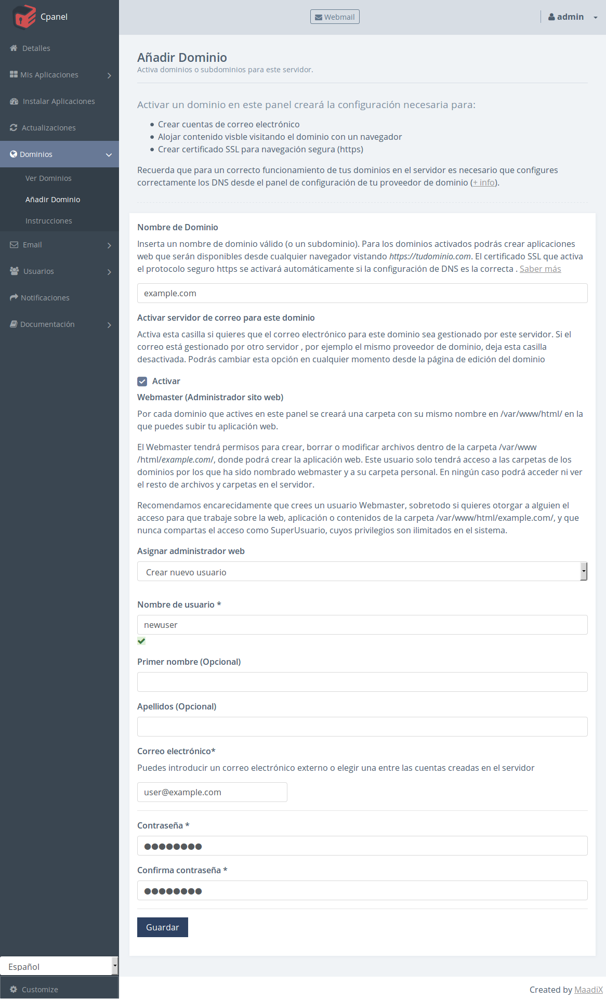
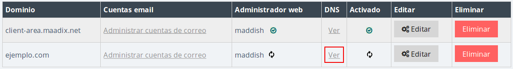
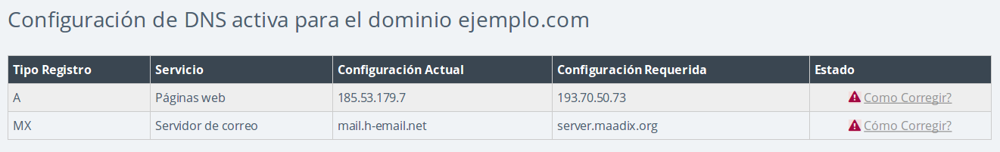

# Configuración de dominios en MaadiX

## Primer paso: Consigue tu dominio

Toda web o aplicación necesita un buen dominio. Si ya dispones de un dominio propio, MaadiX te permite activarlo fácilmente y configurarlo para usarlo en tus aplicaciones.

Si todavía no dispones de dominio propio, aquí te dejamos algunos proveedores de ejemplo donde puedes registrarlo de manera sencilla (¡pero hay muchísimos más [1]!):

* [gandi.net](https://www.gandi.net/)
* [namecheap.com](https://www.namecheap.com/domains/registration.aspx)
* [Dinahosting](https://dinahosting.com/dominios)
* [Njal.la](https://njal.la/)

Sabemos que elegir un buen nombre no siempre es fácil. Por eso, mientras decides cual va a ser tu dominio, puedes seguir usando MaadiX y la mayoría de sus aplicaciones usando https://minombreenmaadix.maadix.org, donde 'minombreenmaadix' coincide con el nombre que elegiste al adquirir tu servidor MaadiX (*no obstante, sólo podrás configurar y usar el servidor de correo electrónico y las listas de correo si dispones de un dominio propio activado*).

Si ya dispones de este dominio propio, sigue las instrucciones de a continuación para activarlo.

## Activa tu dominio

Desde tu panel de control, entra en la pestaña '**Dominios**' y haz clic en '**Añadir dominios**'. 

Se desplegará un formulario con los siguientes campos:

* **Nombre del dominio**:  Introduce el nombre completo de tu dominio o subdominio (por ejemplo: example.com o docs.example.com).

Por cada dominio o subdominio que actives, se creará una carpeta en tu servidor cuya ubicación será `/var/www/html/example.com/`. Debes subir tu web o aplicación a esta carpeta para que sea accesible desde el navegador visitando *example.com*

* **Activar servidor de correo para este dominio**: Si quieres usar el servidor de correo interno para el dominio que estás creando, esta opción tiene que estar activada. Si de lo contrario quieres que el correo electrónico sea gestionado por otro servidor externo, déjala desactivada. 
Podrás cambiar esta opción en cualquier momento desde la página de edición del dominio.

* **Webmaster**: Puedes asignar un webmaster (administrador web) en cada dominio o subdominio que actives en MaadiX.  
  
El webmaster tendrá permisos para crear, borrar o modificar los archivos dentro de la carpeta `/var/www/html/example.com/`, donde podrá crear la aplicación web. Este usuario tendrá acceso mediante SFTP a esta carpeta y a su home, pero no podrá acceder ni ver el resto de archivos o carpetas en tu servidor.

En caso de que no asignaras ningún usuario como webmaster, el webmaster por defecto sería el Superusuario del sistema.

Desde MaadiX recomendamos encarecidamente la creación de un usuario webmaster, especialmente si quieres compartir con alguien el acceso para que trabaje sobre la web, aplicación o contenidos de la carpeta `/var/www/html/example.com/`, de forma que no tengas que compartir nunca el acceso como Superusuario, cuyos privilegios son ilimitados sobre el sistema.

 

## Configura los DNS de tu dominio para que apunten a tu servidor

Tu servidor incluye un sistema que comprueba automáticamente si tu dominio está apuntando correctamente a tu servidor. En caso afirmativo, el mismo sistema procederá con la creación de todas las configuraciones necesarias. En caso contrario, volverá periódicamente a hacer la misma comprobación hasta conseguir una respuesta afirmativa. Para saber si el proceso de activación y configuración del dominio ha terminado con éxito consulta el icono de la sección **Ver Dominios**, dentro de la columna "Activado". 
 

Para que tu dominio apunte hacia tu servidor, debes modificar sus DNS. Los servidores DNS (Domain Name System, Sistema de Nombre de Dominios) son los que transforman los nombres de dominio, pensados para la comprensión humana, en números que corresponden a las direcciones IP de las diferentes máquinas conectadas y accesibles públicamente en Internet.

Haciendo clic en "Ver" en la columna DNS de tu dominio (ver captura de pantalla anterior), encontrarás las configuraciones requeridas para que tu dominio funcione tanto para tu aplicación web (Registro A) como para tu servidor de correo (Registro MX y SPF). 

 

Debes introducir estos datos en la sección correspondiente de la configuración de DNS dentro del **área de cliente de tu proveedor de dominio** (esta fase tienes que completarla fuera de tu servidor MaadiX). Seguramente habrá un enlace o pestaña, quizás en el menú, que diga algo como *DNS*, *Editar registros DNS* o *Editar zona DNS*. Puedes consultar la sección [DNS](dns) para obtener instrucciones detalladas sobre los diferentes tipos de registros necesarios para un correcto funcionamiento de todos los servicios. 

Una vez hechos los cambios, vuelve a consultar la página de configuración de DNS en el panel de control de tu servidor MaadiX, haciendo clic en "Ver" en la columna DNS.  
Recuerda que el proceso de propagación de los nuevos DNS puede tardar hasta 48 horas, de modo que es normal que durante un tiempo la configuración siga resultando incorrecta aunque la hayas cambiado.

## HTTPS

Todos los dominios que actives a través del panel de control tendrán siempre activado un certificado SSL y serán accesibles a través de la dirección:  

https://tudominio.com

La creación y configuración de los certificados está automatizada y se completa junto con todo el proceso de activación y configuración de dominios en tu sistema utilizando [Let's Encrypt](https://letsencrypt.org).  

No  necesitas llevar a cabo ninguna configuración adicional para activar HTTPS para tu dominio: La seguridad en MaadiX es siempre por defecto.  

## Subir tu web o aplicación al dominio propio

Una vez aparezca el check verde en la columna "Activado", ya puedes subir los archivos de tu aplicación web a la recién creada carpeta `/var/www/html/example.com/`. Puedes hacerlo muy fácilmente con un cliente SFTP (por ejemplo, [Filezilla](https://filezilla-project.org/)). Una vez estén ahí, podrás visitarlos desde el navegador en tu dominio *example.com*.

Puedes encontrar más indicaciones aquí: [Crea tu web o aplicación](create-web).

## Empieza a usar tu servidor de correo

Si has activado la casilla 'Activar servidor de correo para este dominio', también puedes empezar a usar tu servidor de correo electrónico. Entra en el apartado *Email > Cuentas mail* para abrir nuevas cuentas de correo.  
Recuerda que los registros MX y SPF tienen que estar correctamente configurados para que apunten a tu servidor.

Puedes encontrar más indicaciones aquí: [Crea y gestiona cuentas de correo](email).

----

(1): Listado completo de las empresas registradoras de dominios acreditadas por el ICANN: [Ver listado](https://www.icann.org/registrar-reports/accredited-list.html)
