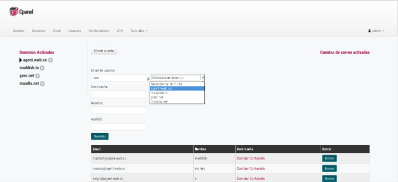

# Email

Puedes añadir infinitas cuentas de email para todos los dominios que tengas configurados.
Antes de añadir cuentas de correo elcetrónico, asegurate de haber configurado correctamente el dominio correspondiente. Aquí encuentras una guía con todos los pasos necesarios: [Configuración de dominio](/dominios)

# Crear cuenta

En al sección 'Email' haz click en el botón Añadir cuenta y rellena los campos del formulario que se despliega. Tendrás que elegir un dominio en el listado de dominios disponibles que habrás activado previamente en la sección 'Domminios'

