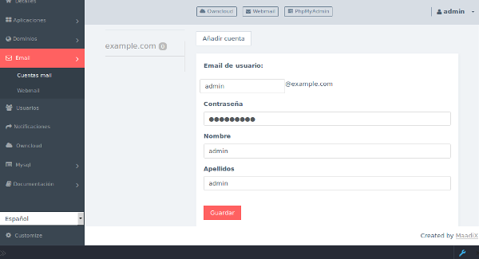
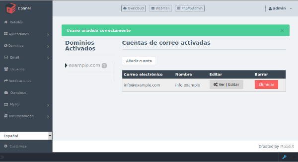
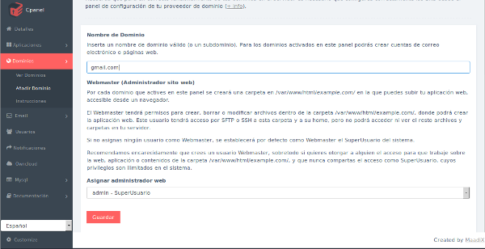
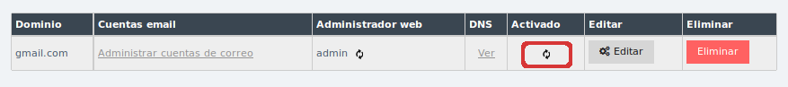
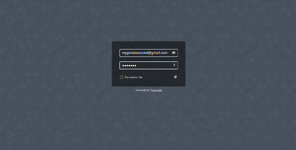

# Email

Puedes añadir infinitas cuentas de email para todos los dominios que tengas activados en tu servidor.  
Antes de añadir cuentas de correo elcetrónico, asegurate de haber configurado correctamente el dominio correspondiente. Aquí encuentras una guía con todos los pasos necesarios: [Configuración de dominio](/dominios)

# Crear cuenta

En al sección 'Email' haz click en el botón Añadir cuenta y rellena los campos del formulario que se despliega. Tendrás que elegir un dominio en el listado de dominios disponibles que habrás activado previamente en la sección 'Domminios'

# Editar cuenta 

Puedes cambiar los parámetros de las cuentas de correos electrónico que tengas activadas visitado el apartado **Email** y haciendo click en el botón Ver|Editar.

# Renvío Automático

En la misma página de edición de cada cuenta de correo electrónico puedes activar el renvío automático de todo el correo entrante a cualquier otra dirección de correo.  

Para ello activa la casilla **Activar reenvío automático a otra cuenta** e inserta una dirección válida en el campo que se despliega (Cuenta de destino para reenvío automático).  

# Webmail - Rainloop

Si has escogido instalar Rainloop en tu servidor, puedes utilizar esta herramienta webmail para consultar e enviar correo electrónico desde tu navegador.  
Desde al panel de control tienes un acceso directo a la aplicación Webmail. Además de poder utilizar la dirección tusubdominio.maadix.org/rainloop puedes utilzar cualquier dominio propio que tengas funcionando en el servidor.  
Si por ejemplo has configurado con éxito el dominio example.com para tu servidor, puedes visitar la interfaz webmail visitando https://example.com/rainloop     

Todas las cuentas de correo electrónico activadas correctamente a través del panel de control pueden ser consultadas a través de la interfaz webmail.    
También puedes utilizar esta misma interfaz para consultar cuentas externas gestionadas por otros proveedores.   

Por ejemplo podrías consultar tu cuenta gmail desde la aplicación webmail.  
Para ello es necesario que añadas el dominio gmail.com en la sección **Añadir Dominios** del panel de control.  

Evidentemente no tienes control sobre el dominio gmail.com y tu servidor nunca podrá crear la configuración necesaria para que la web gmail.com se muestre en tu servidor. Tampoco podrá funcionar como servidor de correo para tu cuenta gmail, así que el estado de este dominio nunca se pondrá en activo.    

 
De esta forma no podrás crear nuevas cuentas de gmail desde tu servidor, ni editar configuraciones relacionadas con tu correo gmail (contraseñas, renvíos automáticos etc).  Sin embargo sí que podrás recibir y enviar emails para cualquier cuenta gmail existente utilizando la interfaz web rainloop que tienes instalada. 

El mismo proceso es válido para yahoo.com, outook.com y la mayoría de servicios de email.

# Cliente de correo
Puedes consultar y enviar tu correo electrónico utilizando un software cliente como Thunderbird, Outlook etc, que tengas instalado en tu ordenador.  
Como para cluaquier otra cuenta que quieras configurar en el cliente, necesitarás los datos de conexión al servidor.  
Estos datos los puedes encontrar en la página Ver|Editar de cuada cuenta de correo que tengas creadas.  

