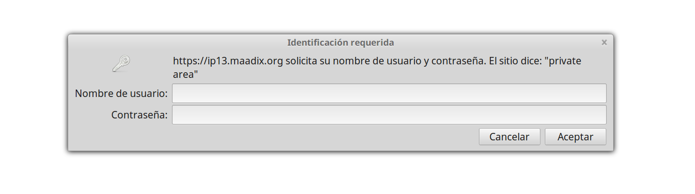
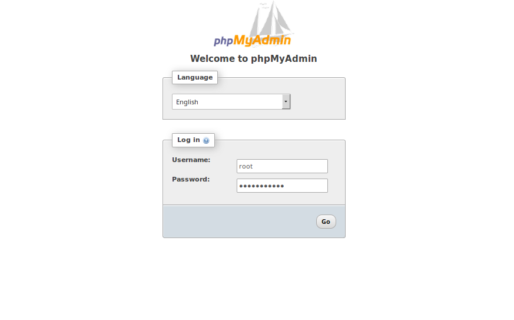
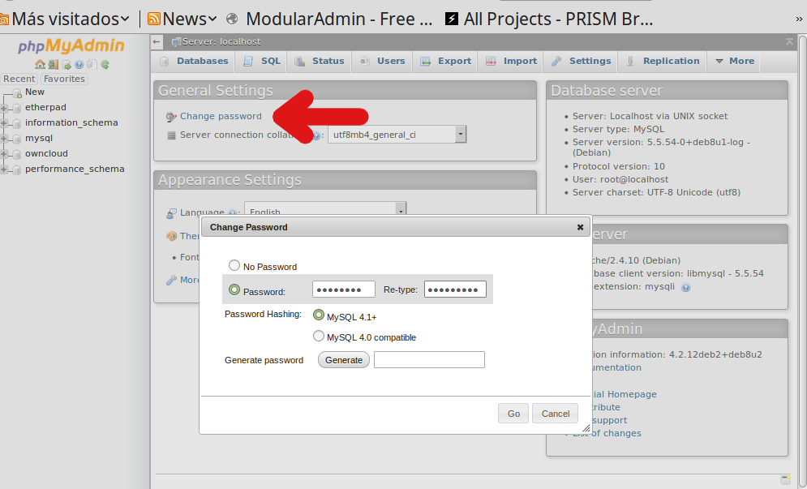

# Etherpad   

Etherpad-lite es una aplicación externa al Panel de Control que permite la edición colaborativa de documentos online en tiempo real entre múltiples usuarios. 
Por defecto, junto con esta aplicación, los servidores creados con MaadiX incluyen una extensión que permite habilitar áreas de trabajo privadas. De etsa manera se puede elegir si los documentos creado son accesibles al público en general o solo a los usuarios que tengan una cuenta activada.  

# Etherpad admin

La aplicación  Etherpad-lite incluye un panel de administración que permite efectuar alguna tarea:

** Editar preferencias
** Instalar/desinstalar plugins
** Reinicar la aplicación

El area de administración de la aplicación está disponible en la dirección:
    minombreenmaddix.maadix.org/etherpad/admin/

o si tienes un dominio porpio activado en el servidor:
    midominio.com/etherpad/admin/

Para poder acceder a esta área tendrás que insertar el nombre de administrador y la contraseña de la aplicación (estos datos están incluidos en el mail de activación del servidor, junto con las otrtras contraseñas).  
Una vez accedido, es recomendable que cambies la contraseña.  Para ello, haz click en la pestaña 'Setting' del menú de la izquiera.  
 Se abrirá un archivo en texto plano  que contiene todos los parámetros de tu instalación.  
Haz scroll hasta el final de este archivo, donde encontrarás unas líneas parecidas a las siguientes:

      "users": {
        "admin": {
        "password": "yourpasswordhere",
        "is_admin": true
        }
      }

1 - Cambia el valor del password por tu nueva contraseña, teniendo cuidado de que se quede incluida entre las comillas.    
2 - Haz click en 'Save Settings'  
3 - Haz Click en 'Restart Etherpad'  
 
![Change etherpad password] (img/ch-paswd.png)  

# Etherpad Área Privada 

MaadiX ha desarrollado un plugin de etherpad-lite que permite crear espacios privados de trabajo, y que por defecto se instala junto con la aplicación.  
Desde el área de administración de etherpad-lite se  pueden establecer preferencias de configuración para la instalación.  
Haciendo click en la pestaña 'Users and groups' aparecerán las siguientes opciones:  

** Allow users to recover lost password - Activar esta opción permitirá a todos los usuarios recuperar su contraseña.  
** Allow users to register - Si esta opción está activada cualquier persona podrá crear un usuario , crear su propio grupo e invitar otros colaboradores a su grupo.  
** Allow public pads - Pemite crear documentos sin necesidad de tener un usuario activado, ni pertenecer a ningún grupo.

## Segunda contraseña  
Una vez efectuada satisfactoriamente esta autentificación, se muestra la interfaz de la aplicación PhpMyAdmin, que solicitará un usuario Mysql. Por defecto exite un usuario Mysql cuyo nombre es root y cuya contraseña está incluida en el correo electrónico que se envia en el momento de activar el servidor, junto con las otras contraseñas y que puedes utilizar para acceder a la aplicación.  

Es muy recomendable cambiar la contraseña del usuario root. Puedes hacerlo desde la misma aplicación :

   

Además es buena práctica crear un usuario Mysql diferente por cada base de datos y otorgarle permisos solo sobre una y no todas las bases de datos que tengas creadas.

Tanto las bases de datos como los usuarios mysql y sus contraseñas se pueden crear e administrar desde PhpMyadmin.  
Por defecto solo el usuario root de Mysql tiene los privilegios necesarios para crear nuevas bases de datos, nuevos usuarios, y otorgar permisos a cada uno de ellos.  

Puedes encontrar aquí la documentación oficial para el uso de la aplicación  

[https://www.phpmyadmin.net/docs/](https://www.phpmyadmin.net/docs/)
