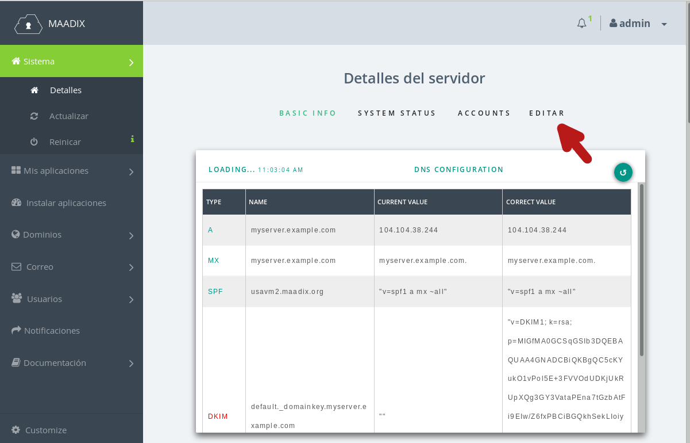
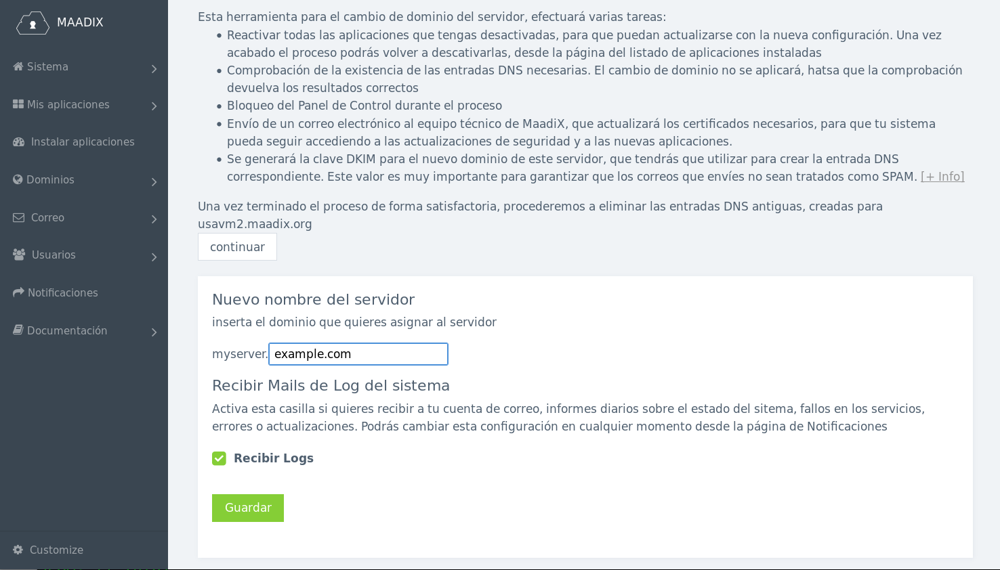
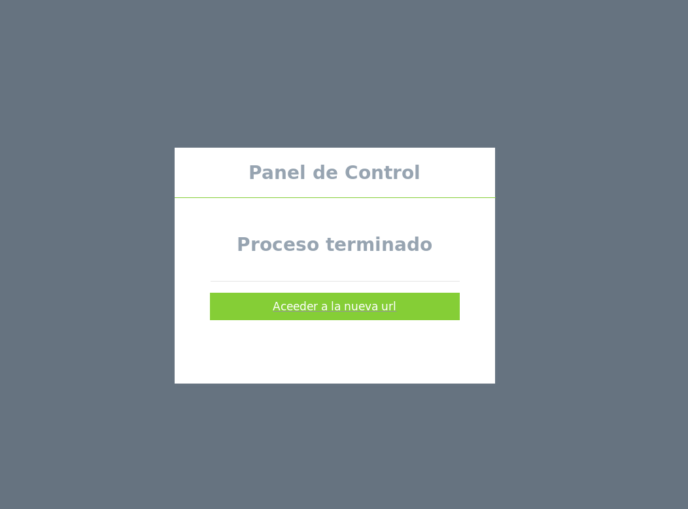
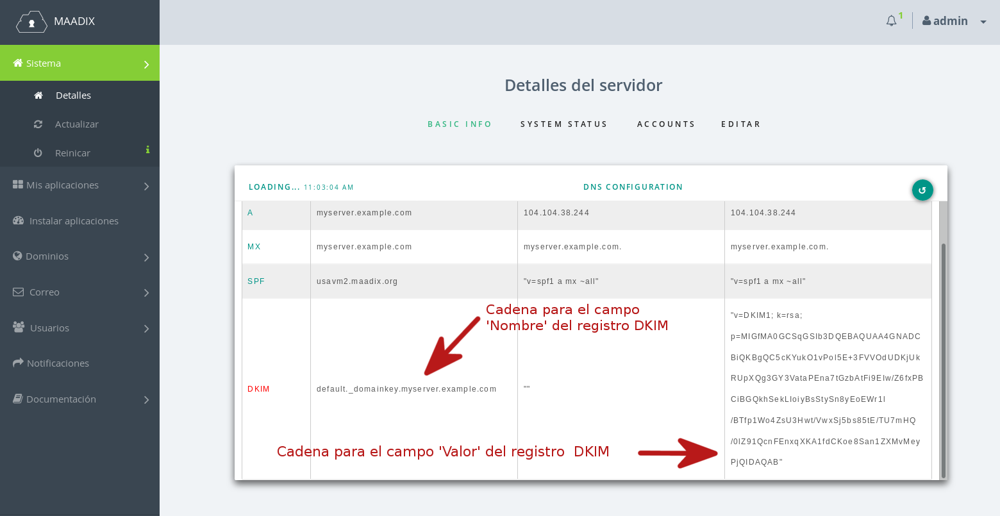
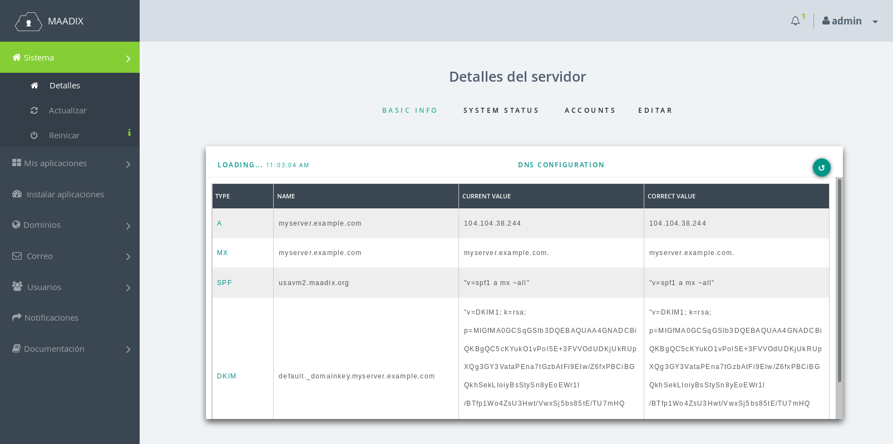
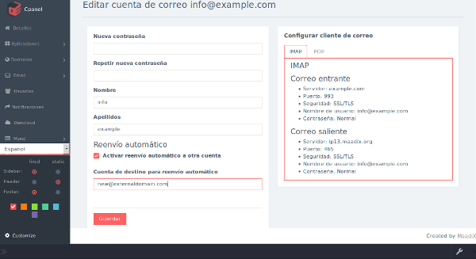

# Cambiar Nombre del Servidora (FQDN)

El Nombre de servidor es un valor (normalmente un subdominio), que distingue de forma única una máquina en Internet. Este valor se denomina, en términos técnicos, Fully Qualified Domain Name (FQDN).

Cuando das de alta un servidor con MaadiX, puedes elegir un nombre para tu equipo, al que por defecto asignamos un subdominio de maadix.org. Así, por ejemplo, si el nombre que has escogido fuese 'myserver' el nombre completo de tu servidor será 'myserver.maadix.org'. 

MaadiX se encarga de crear todas las configuraciones necesarias para que el servidor funcione correctamente. Esto incluye no solo las configuraciones del sistema, sino también las entradas DNS necesarias para el subdominio recién creado. Sin estos registros DNS, el servidor no podría funcionar correctamente.

Hemos elegido implementar esta forma para simplificar y hacer más rápido el proceso de creación de los servidores, sin embargo, puedes decidir dejar de usar el subdominio 'maadix.org' que hemos creado, para pasar a usar tu propio dominio.   

En esta página explicamos como puedes cambiar el dominio principal asociado a tu servidor a través del panel de control, y todas las acciones paralelas que tendrás que llevar a cabo, para que el cambio se exitoso, y todos los servicios funcionen correctamente.  

## Antes de empezar  

Utilicemos "myserver.maadix.org", como ejemplo de nombre actual, asoicado a tu servidor.   
Este valor es el FQDN de tu máquina y está compuesto por dos partes: "myserver" [Nombre del equipo] , y "maadix.org" [Dominio asociado].  
Antes de proceder con el cambio, ten en cuenta que el valor "Nombre del equipo" (myserver) no puede ser cambiado. Solo podrás cambiar el valor "Dominio Asociado". Así, por ejemplo, si el dominio que quieres usar a partir de ahora fuera "example.com", tu nuevo FQDN será "myserver.example.com".  

El primer paso para proceder, será entonces crear el subdominio myserver.example.com, y las entradas DNS correspondientes y necesarias.  

## Configuración de DNS  

Esta es la parte más tediosa del proceso, pero es indispensable que la lleves a cabo de forma correcta y antes de proceder con el cambio desde el panel de control.  

Estas configuraciones las tendrás que hacer desde el panel de gestión de Zonas DNS, de tu proveedor de dominio.  
Los registros necesarios y sus valores son los siguientes:  

|  Tipo    |   Npmbre                |     Valor           |  
|----------|-------------------------|---------------------|
|   A      |myserver.example.com     | IP.DE.TU.SERVIDOR   | 
|   MX     |myserver.example.com     | myserver.example.com|
|   TXT    |myserver.example.com     | "v=spf1 a mx ~all"  | 

Tendrás que sustituir myserver.example.com por el nuevo subdominio ( nombre de equipo + dominio que quieras utilizar),y el valor IP.DE.TU.SERVIDOR por el valor real de la IP de tu servidor. 

Una vez aplicados los cambios hay que esperar que la nueva configuración sea propagada por la red. Este proceso puede tardar entre pocos minutos y varias horas, dependiendo de tu proveedor de dominio. El panel de control integra un sistema de comprobación, por lo que no arrancará el proceso de cambio hasta que los dns estén propagados.  

Hay otro registro DNS que tendrás de activar, y cuyas instrucciones encontrarás más abajo. Se trata del registro DKIM, que consiste en el valor de una clave que se genera durante el proceso, por lo que solo podrás activarlo una vez terminados los pasos que se describen a continuación.  

## Cambio en el panel de control  

Terminada la operación anterior, accede al panel de control y en la página principal haz clic en la pestaña 'Editar'.  

Se abrirá la página para poder proceder con el cambio, y que incluye instrucciones para la configuración de los DNS y otras advertencias a tener en cuenta. Aconsejamos que leas detenidamente todas las indicaciones.  

El proceso es extremadamente sencillo. Solo tendrás que insertar el dominio que quieras utilizar en el fomrulario que se muestra al hacer clic en 'continuar'.  

  

Adicionalmente, puedes activar la casilla 'Recibir Logs'.  
Esto te permitirá recibir a tu cuenta de correo, informes diarios sobre el estado del sitema, fallos en los servicios, errores o actualizaciones. 
Si no la activas, estos informes se enviarán a una cuenta a la que tiene acceso el equipo técnico de MaadiX, para que se puedan consultar en el caso que se produzcan errores.  

Podrás cambiar esta configuración en cualquier momento desde la página de Notificaciones.  

Antes de empezar el proceso, el sistema comprobará que las entradas DNS necesarias estén creadas correctamente y en caso afirmativo, procederá con el cambio.  

Esta opración es un poco más larga que otras tareas administrativas, ya que se tienen que reconfigurar varios servicios y paquetes presentes en el sistema. Ten paciencia.  

Un avez completado el proceso, tendrás que acceder al panel de control utilizando tu nueva dirección:  

    https://myserver.example.com/cpanel  

El enlace para acceder a la nueva dirección aparecerá automáticamente, una vez terminado el proceso.  

  

Si por cualquier razón, se te ha cerrado la ventana, introduce manualmente la nueva dirección en el navegador. Recuerda que solo estará disponible al final del proceso.  

## Configurar DKIM  

Es muy importante que, una vez terminado el cambio, añadas el registro DKIM a los DNS del dominio, desde el panel de gestión de DNS que te proporciona tu proveedor de dominio.    
Este registro asegura la identidad y legitimidad de los correos electrónicos enviados desde el servidor, por lo que es indispensable para evitar que tus mensajes sean tratados como SPAM.  

Lo primero que necesitas es saber cuales son los valores correctos para la entrada DNS. Esta información está ahora disponible en el panel de control, en la tabla 'DNS Configuration' que encuentras en la página principal.  

El registro DKIM es un registro de tipo TXT, cuyo nombre y valor necesarios puedes copiar desde la tabla. Al consultarla, verás que en la primera columna, el texto está marcado en rojo. Significa que no hay coincidencia entre el valor requerido y el valor encontrado.   

  

La configuración del DKIM es la más complexa, y la sintáxis puede variar en funcion de cada proveedor. En este enlace encontrarás una explicación detallada sobre su funcionamiento y configuración, además de una herramienta para comprobar que la entrada DNS que ha insertado es correcta.  

https://docs.maadix.net/dns/#registro-dkim  

Cuando hayas terminado, y una vez los DNS se hayan propagando, la misma tabla te devolverá  los valores encontrados para el registro DKIM. Si son correctos, en la primera columna el texto que anteriormente estaba en rojo, se habrá puesto en verde, marcando el éxito de la operación.  

## Últimos pasos  

### Correo electrónico  

Si estás usando algún cliente de correo electrónico en algún dispositivo (Thunderbird, Outlook, k9...) tendrás que cambiar el valor para el servidor de entrada y de salida, y sustituirlo con el nuevo. Encontrarás los nuevos valores de configuración en la página de edición de las cuentas de correo electrónico del panel de control. 

### VPN

Si tienes activada alguna cuenta VPN, tendrás también que volver a cargar la configuración en el cliente que utilizas para la conexión, ya que el certificado se ha modificado, y el anterior dejará de ser válido.  

