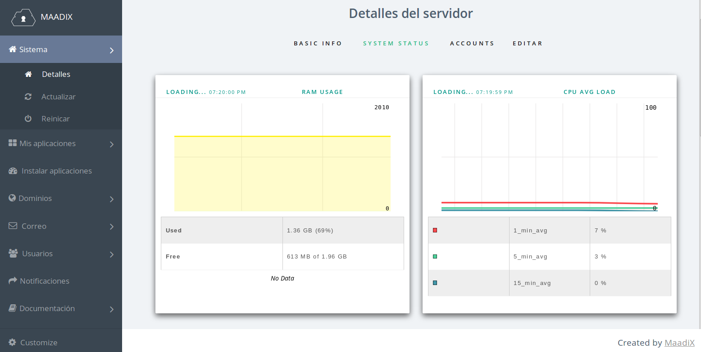
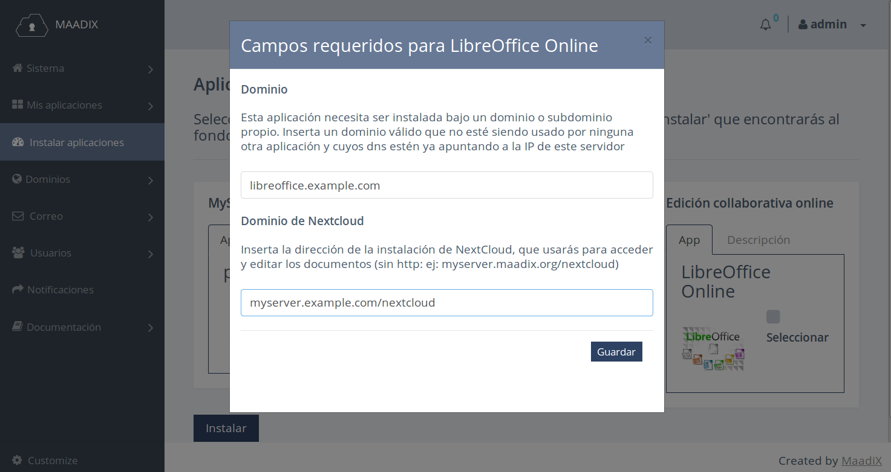
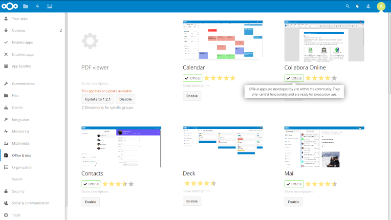
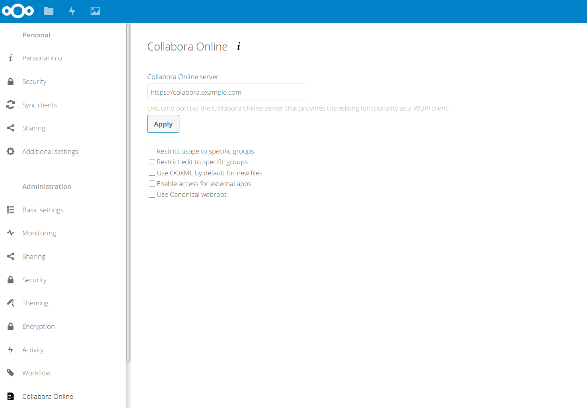

# Libre Office Online

Libre Office Online es una aplicación que proporciona la posibilidad de editar de forma colaborativa y en tiempo real, documentos en un navegador, reutilizando el núcleo de LibreOffice.   

Constituye una alternativa a Google Docs, y permite editar documentos de texto enriquecido, hojas de cálculo y presentaciones. Acepta un gran número de formatos (.odt, .doc, .docx, .ods, xls, .xlsx, .odp,.ppt, .pptx...).  

Para utilizarla se necesita también una instalación de Nextcloud, que será el interfaz que permitirá acceder a la edición de los documentos.  
Con Libre Office Online, los documentos almacenados en Nextcloud, se abrirán en el navegador para su lectura/edición, en lugar de mostrarse la opción de descarga.  

## Requisitos del sistema  

Antes de proceder con la instalación, es aconsejable averiguar que el servidor tenga los recursos disponibles necesarios para un buen funcionamiento.  Estos requisitos dependerán de la cantidad de documentos/usuarios simultáneos. Cada vez que se abre un documento para su edición, éste se carga en memoria. La cantidad de memoria necesaria dependerá así de cuántos documentos se planifica poder editar de forma simultánea. De todas formas, en línea general, y para una mejor experiencia, es ideal disponer de al menos 300 MB de RAM libre.  

En el panel de control, en la sección Detalles -> System Status puedes consultar este dato. 

## Instalación  

Antes de proceder con la instalación es necesario decidir bajo qué dominio o subdominio se quiere alojar la aplicación. Usaremos como ejemplo el subdominio libreoffice.example.com.  

Tendremos que crear una entrada DNS de tipo A, que apunte a la IP del servidor.

 `libreoffice.example.com A IP.DE.TU.SERVIDOR`  

Según el proveedor de dominio que tengas, la propagación de los DNS puede tardar entré pocos minutos y unas horas. Una vez los DNS estén propagados podrás proceder a la instalación desde el panel de control.  

Al hacer clic en Libre Office Online, desde la página 'Instalar aplicaciones', se abrirá una ventana emergente, en la que tendrás que insertar dos valores:  
1- El nombre del dominio/subdominio que quieres utilizar para instalar la aplicación. En el caso de nuestro ejemplo será libreoffice.example.com  
2- El dominio de la instalación de Nextcloud, que quieres conectar al Libre Office Online, es decir la url que utilizas para acceder a Nextcloud con el navegador, por ejemplo myserver.example.com/nextcloud  

## Conectar Nextcloud

Una vez terminado el proceso de instalación de Libre Office Online, es necesario instalar y configurar la extensión Colabora Online desde Nextcloud. Para activarla, visita la sección Apps -> Office & Text, como administrador de Nextcloud.

Una  vez activada tendrás que ir a Configuración -> Collabora Online e insertar la url de instalación de la aplicación con 'https://'. En el caso de nuestro ejemplo 'https://libreoffice.example.com'.  

A partir de ahora, cada vez que accedas a un documento desde la sección Files/Archivos, se abrirá en el navegador para su edición.

