# Introducción  

Mailman es un software que permite crear y administrar listas de correo electrónico y boletines (newsletter), el cual comprende tres diferentes interfaces web diferentes.

* **Administración**    
* **Gestión de listas**    
* **Archivos de listas**    

Cuando la instalación de la aplicación de Mailman en tu servidor termine, se te enviará un correo electrónico que incluye el nombre de usuario y la contraseña del administrador de la aplicación.

# Cambiar contraseña  

Como para todas las demás aplicaciones que instales en el servidor, lo primero que harás es cambiar la contraseña del usuario administrador por razones de seguridad. Para hacerlo, haz clic en el icono de usuario arriba a la derecha y selecciona 'Account'. Se abrirá una página que te permitirá cambiar la contraseña, además de configurar otros parámetros.

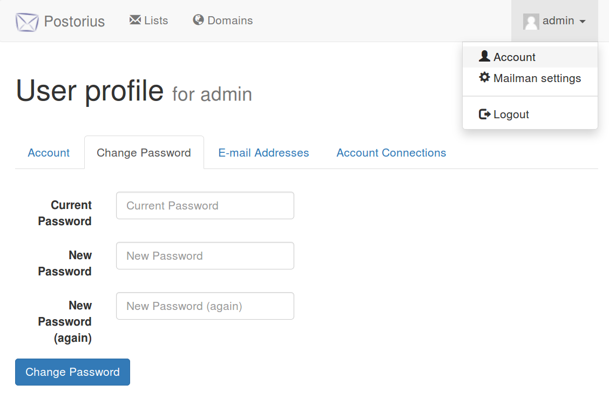

# Configurar dominio

Las listas de correo funcionan bajo un dominio o subdominio propio. Esto significa que no puedes crear listas de correo utilizando el mismo dominio que estás utilizando para cuentas de email. En el caso que estés utilizando el dominio example.com para cuentas de de correo electrónico (admin@example.com, info@example.com....), no podrás utilizar el mismo para crear listas de correo. Lo que tendrás que hacer es crear un subdominio de example.com y configurar los DNS antes de empezar a crear listas.  

# Activar dominio o subdominio en Mailman

Para dar de alta un dominio o subdominio y poder empezar a crear listas de correo o boletines (newsletter), accede a la interfaz Mailman que encontrarás en https://minombreenmaadix.maadix.org/mailman, donde 'minombrenmaadix' será el nombre de tu subdominio en MaadiX. 
Una vez autenticado (pestaña 'Login' arriba a la derecha de la ventana), aparecerá la pestaña 'Domains' en el menú superior. Accede a esta página y haz clic en el botón 'Add Domain' (Añadir dominio).  
Como ejemplo utilizaremos listas.example.com, pero puedes asignar el nombre que prefieras (news.example.com, info.example.com...).

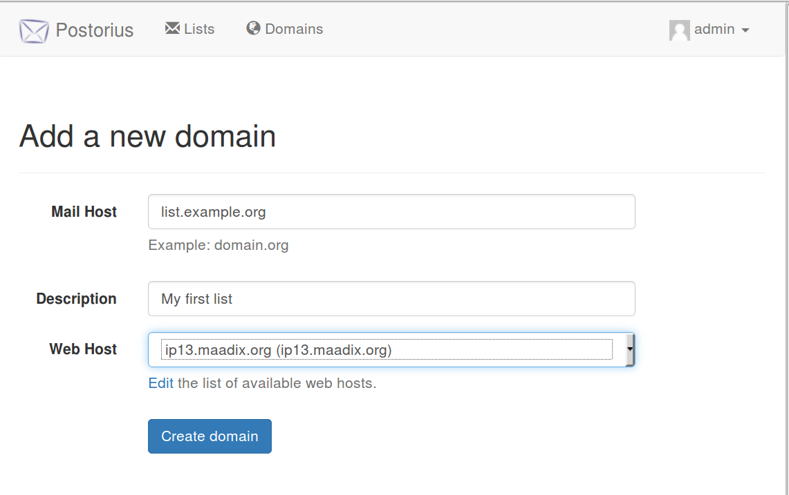

Tendrás que rellenar los tres campos siguientes:

* **Mail Host**: el nombre del dominio o subdominio bajo el cual se podrán crear listas (en nuestro caso listas.example.com, por el que tendremos que crear luego las entradas DNS correspondientes).  
* **Description**: una descripción para el dominio o subdominio (opcional).  
* **Web Host**: la dirección web en la que será posible acceder a las opciones para las listas de este subdominio. Puedes dejar el valor por defecto minombrenmaadix.maadix.org o bien añadir otro dominio o subdominio, siempre que esté activado en el panel de control y funcione correctamente. Esta será la dirección web que se enviará a los suscriptores para acciones tales como confirmar suscripción, consultar listas públicas u otras.  

En el caso de este ejemplo, el **Web Host** podría ser el dominio example.com o incluso el mismo subdominio listas.example.com, que deberá tener los DNS correctamente configurados para que apunten a tu servidor, y tendrá que estar activado en el panel de control. Si decides utilizar el mismo dominio o subdominio de las listas como dirección para la interfaz gráfica, es muy importante que no actives el servidor de correo para él. Deberás entonces activar el subdominio listas.example.com en el panel de control, dentro de la sección 'Añadir Dominios', sin marcar la casilla 'Activar servidor de correo para este dominio'.  
De esta forma, se creará la configuración necesaria para que el subdominio listas.example.com se pueda visitar desde el navegador, sin que se active el servidor de correo. Si activaras el servidor de correo para un dominio que quisieras utilizar para las listas, podrías experimentar problemas en la entrega de los mensajes.  

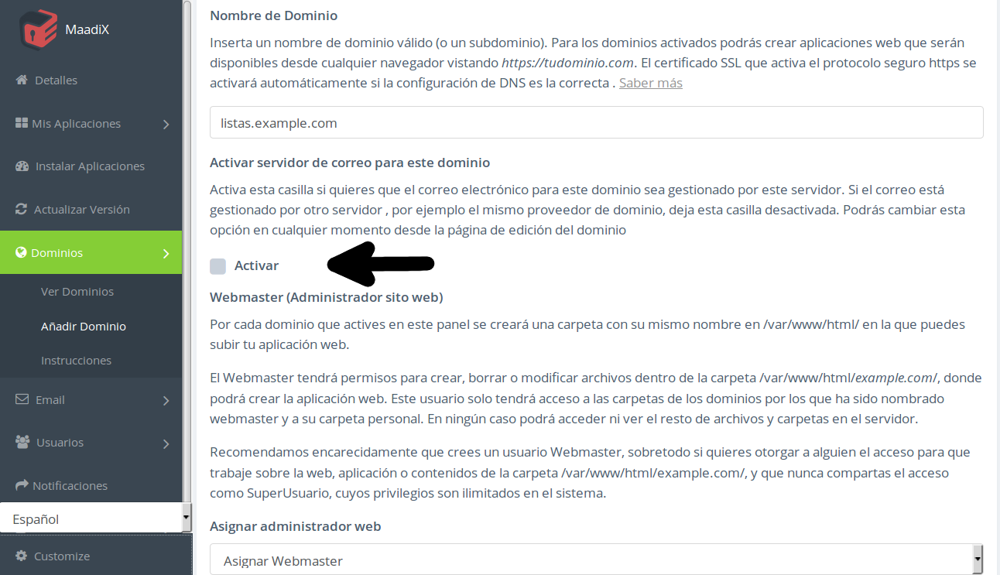

# Crear listas de correo o boletines  

Una vez añadido un dominio a la aplicación Mailman, puedes crear una o más listas de correo o boletines bajo el mismo dominio. 
Para hacerlo, visita la pestaña 'Lists' en el menú de arriba y luego haz clic en 'Add new List'.  

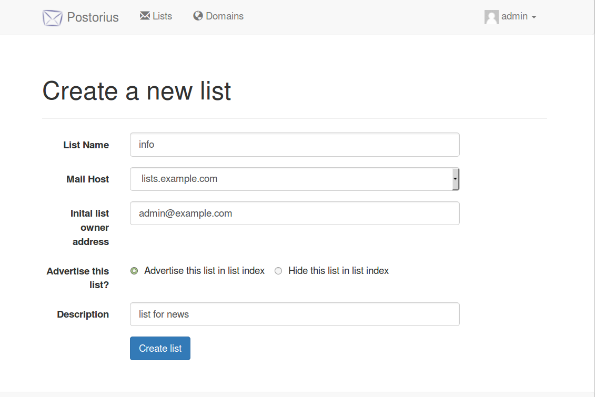  

Tendrás que rellenar los siguientes campos:  

* **List Name**: el nombre de la lista. En el ejemplo, crearemos la lista 'info'.  
* **Mail Host**: el dominio para la listas. En el desplegable escogemos el subdominio recién creado lists.example.com.  
* **Initial list owner address**: asignamos una cuenta de correo como propietaria / administradora de la lista.  
* **Advertise this list?**: esta opción establece si la lista será visible publicamente en el listado de listas creadas o no. Para que se muestre, elegiremos 'Advertise this list in list index', mientras que si elegimos 'Hide this list in list index' solamente la verá el administrador.
* **Description**: una descripción informativa de la lista (opcional).  

Una vez completada esta fase, ya habremos creado la lista. A continuación, tendremos que establecer nuestras preferencias de configuración.

**Establecer parámetros del archivo de la lista**

Puedes elegir si los mensajes enviados a los suscriptores se conservan y almacenan y, en tal caso, si serán visibles por cualquier persona a través de un enlace público o solamente serán accesibles a personas autorizadas.

En Settings > Archiving > Archive policy:

* **Public archives**: cualquiera puede consultarlos a través del interfaz web de tu instalación de la aplicación.
* **Private archives**: el historial se guarda, pero solamente los administradores pueden acceder a él.
* **Do not archive this list**: no se guarda el historial de mensajes enviados.

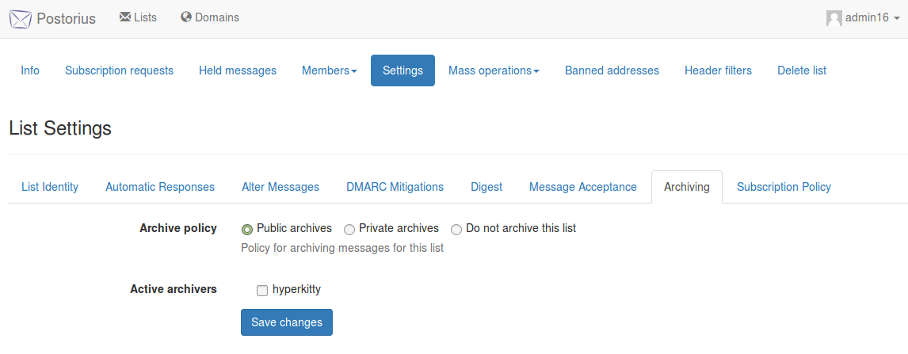

**Notificación de cambios en la suscripción**

En Settings > Automatic Responses > Notify admin of membership changes, marca la casilla si quieres que se notifique al administrador de las altas y las bajas del boletín.

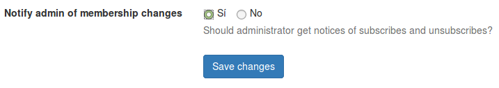

Una vez creada la lista, debes seguir un proceso de configuración específico para convertirla en un boletín (newsletter) o una lista de correo.  

# Configurar un boletín (Newsletter) 

Recuerda que el boletín se caracteriza por su unidireccionalidad: solamente el administrador de la lista o las cuentas expresamente autorizadas pueden enviar mensajes (en oposición a las listas de correo, en las que todo el mundo puede participar).

**Establecer parámetros de suscripción**

En Settings > Subscription Policy, elige una de las siguientes opciones del desplegable:

* **Open**: cualquiera puede ser añadido al boletín sin precisar su confirmación.
* **Confirm**: las suscripciones tienen que ser confirmadas desde un correo válido al solicitar el alta.
* **Moderate**: un moderador tiene que autorizar manualmente cada alta.
* **Confirm then Moderate**: enviar primero un correo de confirmación al usuario para que luego un moderador autorice el alta.

Aconsejamos la opción 'Confirm' para que no se puedan añadir direcciones de correo sin consentimiento.

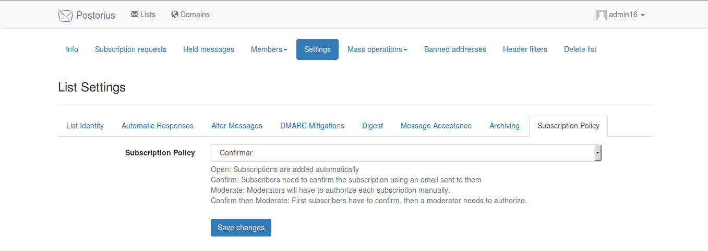

**Establecer parámetros para los mensajes entrantes**

Determina cómo se tratan los mensajes dirigidos a la lista por parte de los usuarios miembros y no miembros. Puesto que se trata de un boletín, se denegará la entrega de cualquier mensaje entrante cuyo remitente no esté autorizado.

En Settings > Message Acceptance, define los siguientes parámetros:

* **Default action to take when a member posts to the list: Discard** (se descartarán todos los mensajes provenientes de usuarios suscritos).
* **Default action to take when a non-member posts to the list: Discard** (se descartarán todos los mensajes provenientes de usuarios no suscritos).

Con esta configuración, cualquier mensaje dirigido a la lista por parte de un remitente no autorizado será automáticamente rechazado sin notificar a la persona. Si prefieres que reciban una notificación, sustituye la opción Discard por Reject (with notification).

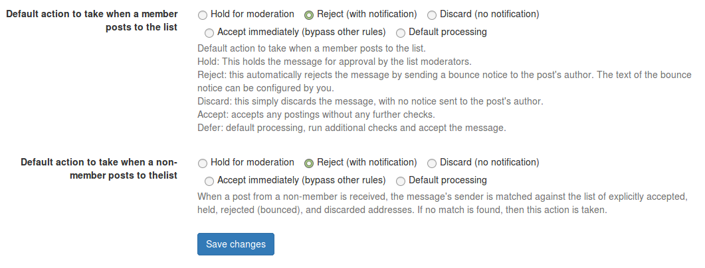

**Configuración de los envíos de boletines**
En este momento, ninguna persona está autorizada a enviar correos, así que es necesario conceder este permiso a almeno una cuenta de correo, para poder hacer los envíos.  
En Members > Suscribers > encuentrass el listado de suscriptores.
Escoge la cuenta de correo que quieres utilizar para enviar las newsletter, y haz clic en 'Member Options'. Si la cuenta no está presente en el listado, tendrás primero que añadirla (Mass operations > Mass suscribe). 
Al fondo de la página Member options seleciona 'Accept immediately' como parámetro de moderación, para que la cuenta seleccionada pueda enviar los boletines. Recuerda que debes autorizar una cuenta como mínimo para poderlos enviar, y que puedes autorizar más de una cuenta para la misma lista.  

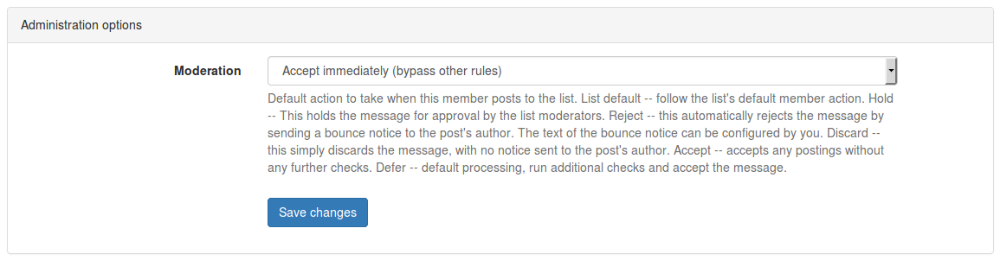

# Configurar una lista de correo

Una vez creada la lista, debes seguir un proceso de configuración específico para convertirla en una lista de correo ('Mailing list'). Recuerda que la lista de correo se caracteriza por ofrecer a todos los usuarios la posibilidad de participar (no es unidireccional como el boletín).

**Establecer parámetros de suscripción**

En Settings > Subscription Policy, elige una de las siguientes opciones del desplegable:

* **Open**: cualquiera puede ser añadido a la lista sin precisar su confirmación.
* **Confirm**: las suscripciones tienen que ser confirmadas desde un correo válido al solicitar el alta.
* **Moderate**: un moderador tiene que autorizar manualmente cada alta.
* **Confirm then Moderate**: enviar primero un correo de confirmación al usuario para que luego un moderador autorice el alta.

Aconsejamos la opción 'Confirm' para que no se puedan añadir direcciones de correo sin consentimiento.

**Establecer parámetros para los mensajes entrantes**

Para las listas de correo, en las que los miembros pueden mantener conversaciones entre ellos, puedes determinar cómo se tratan los mensajes dirigidos a la lista, tanto por parte de los usuarios suscritos como por parte de los que no lo están.

En Settings > Message Acceptance:

Para usuarios suscritos, elige entre una de estas dos opciones dentro de 'Default action to take when a member posts to the list':

* **Hold for moderation**: un moderador tiene que autorizar cualquier mensaje para que sea entregado al resto de suscriptores.
* **Accept immediately**: los mensajes de los suscriptores se entregarán automáticamente a todos los demás suscriptores, sin necesidad de moderación. Esta es la opción estándar para las listas de correo.

Para usuarios no suscritos, elige la opción que prefieras dentro de 'Default action to take when a non-member posts to the list':

* **Hold for moderation**: un moderador tiene que dar su autorización para que el mensaje sea entregado a los suscriptores de la lista.
* **Reject**: se rechazarán automáticamente todos los mensajes, notificando al remitente.
* **Discard**: se rechazarán automáticamente todos los mensajes, sin notificar al remitente.
* **Accept immediately**: se aceptarán automáticamente todos los mensajes, sin necesidad de moderación.

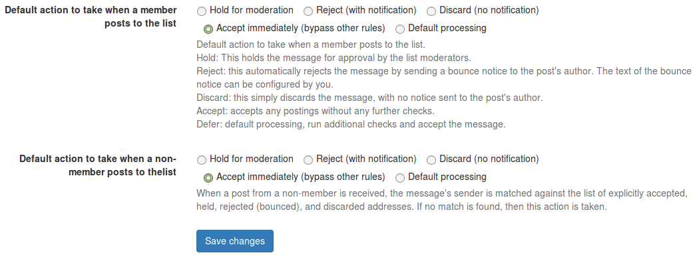

# Configurar DNS para el dominio o subdominio  

Para que las listas creadas funcionen correctamente, es necesario configurar los DNS para el dominio o subdominio añadido.  

Como primer paso, necesitas acceder a través del panel de control a los valores requeridos para los registros DNS.  
El panel de control detectará automáticamente los dominios o subdominios activados desde Mailman y te devolverá los valores correctos para las entradas DNS, que tendrás que configurar en el panel que te proporciona tu proveedor de dominio (operación externa a MaadiX).

Accede al panel de control y consulta la pestaña Mis Aplicaciones > Mailman > Dominios de listas en el menú de la columna izquierda. Te aparecerá un listado de todos los dominios añadidos desde Mailman.  

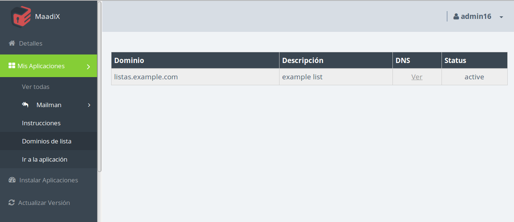  

Haz clic en el enlace 'Ver' de la columna DNS del dominio o subdominio que quieras configurar.  

Aquí encontrarás los valores DNS necesarios para una correcta configuración. Si solamente quieres usar este dominio o subdominio para listas de correo, será suficiente que configures los DNS para los valores MX, TXT y DKIM, que encontrarás en la tabla 'Servidor de Correo'. 

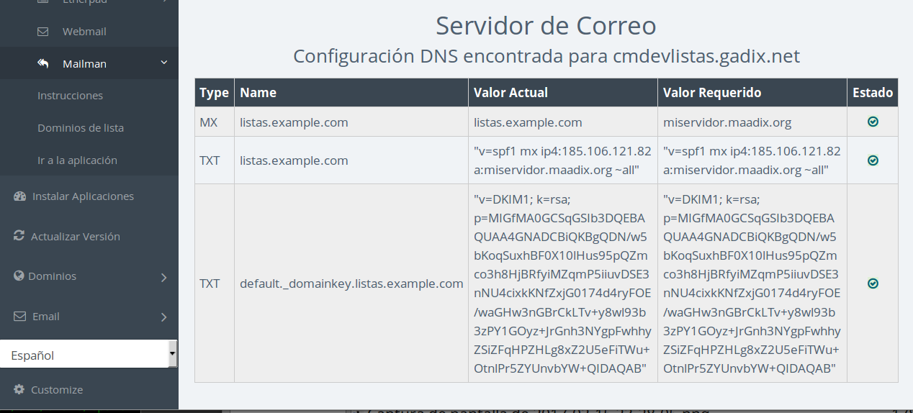

Para crear un subdominio o configurar los DNS de un dominio existente, tendrás que entrar en el panel de administración que te proporciona tu proveedor (Gandi, Dinahosting, etc...). Lamentablemente, cada interfaz es diferente dependiendo del proveedor, de modo que no existe una manera única de llevar a cabo este proceso. Consulta la sección [DNS](dns) de esta guía de uso para más información.

