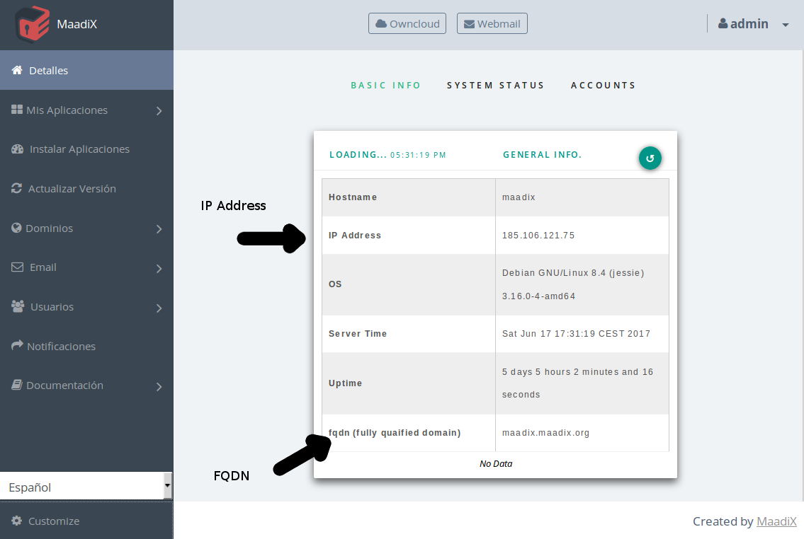

# Introdución  

Mailman es un software que permete crear y administrar listas de correo electrónico y boletines (newsleeter).
Comprende tres diferentes interfaces web.

** Admministración
** Gestión de listas
** Archivos de listas

Si has instalado mailman el servidor te enviará un correo electrónico que incluye el nombre de usuario y la contraseña del administrador de la aplicación.  

# Cambiar contraseña  

Como para todas las demás aplicaciones que instales en el servidor, lo primero que harás es cmabiar la contraseña del usuario administrador.  Para ello haz click en el icono de usuario arriba a la derecha y selecciona Account. Se te abrirá una página que te permitirá cambiar la contraseña además de configurar otros parámetros.

# Configurar dominio

Las listas de correo funcionan bajo un dominio o subdominio propio. Esto significa que no puedes crear listas de correo utilizando el mismo dominio que estás utilizando para cuentas de email. En el caso que estés utilizando el dominio example.com para cuentas de de correo electrónico (admin@example.com, info@example.com....) no podrás utilizar el mismo para crear listas de correo. Lo que deberás hacer es crear un subdominio de example.com y configurar los dns antes de empezar a crear listas.  

Para añadir un subdominio tendrás que entrar en el panel de administración que te proporciona tu proveedor (gandi, dynahosting, etc). Lamentablemente cada interfaz es diferente dependiendo del proveedor. Busca tutoriales para tu caso o ponte en contacto con el servicio técnico de la empresa la que has comprado el dominio, en el caso tengas dudas. 

Como ejemplo utilizaremos listas.example.com, pero puedes asignar el nombre que prefieras (news.example.com, info.example.com).  

Tendrás que crear los registros A y MX para el subdominio listas.example.com

Para el registro A asignarás como valor la IP de tu servidor. 
Para el registro MX asignarás el nombre del subdominio de tu servidor en maadix (fqdn): tunombre.maadix.org 

Puedes encontrar los valores correctos correspondiente a tu servidor en la página principal del Panel de Control.    

Recuerda que estoscambios pueden tardar unas horas en hacerse efectivos, por lo que el nuevo subdominio creado puede no estar
funcionando de forma inmediata.

Una vez creado el subdominio y editados los registros dns puedes ir a la interfaz de mailman e activarlo.  
En el campo Mail Host insertas el subdominio recién creado.  
El cammpo Web Host se refiere a la URL que puedes utilizar para acceder a la interfaz web de mailman.  Por defecto tienes activado el subdominio de tu servidor en maadix.org, pero si lo prefieres puedes añadir tu propio subdominio listas.example.com o cualquier otro dominio, mientras tengas el registro A de los DNS correctamento configurado (tiene que apuntar a la IP de tu servidor para que funcione).  

# Crear Lista de Correo

En este ejemplo hemos creado una lista 'info' para el dominio lists.example.com. La dirección para escribir a la lista será info@lists.example.com.  
Esta lista será visible publicamente en el listado de listas creadas. Puedes elegir que no se muestre si así lo prefieres.  
