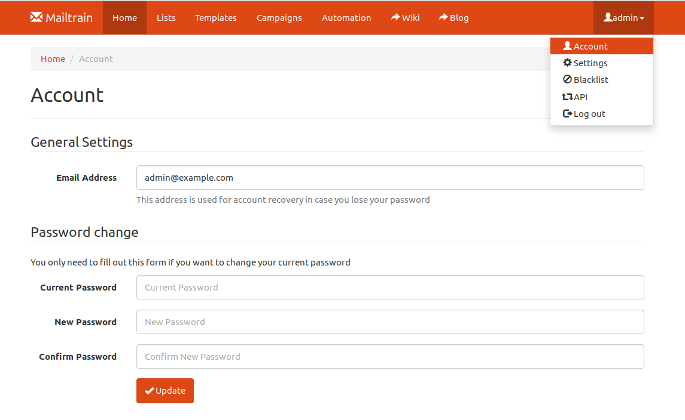
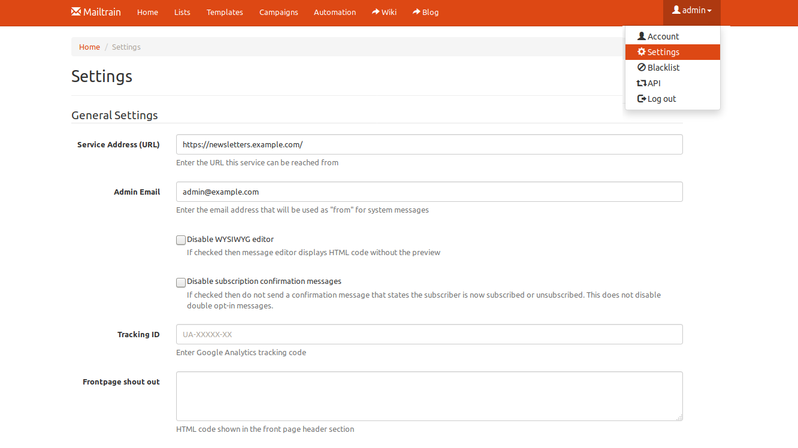
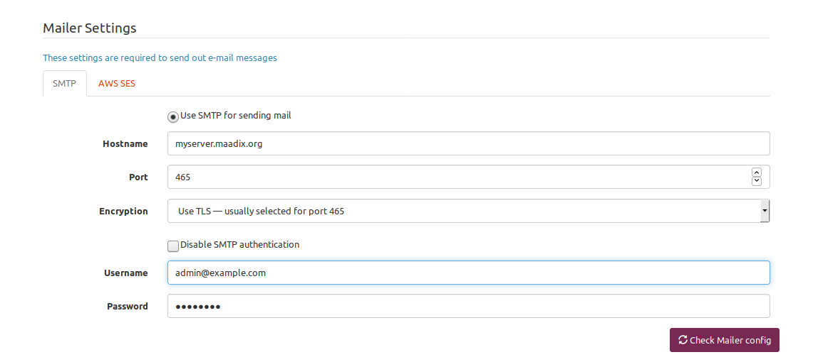

#  Mailtrain

Mailtrain es una aplicación de código abierto que permite crear campañas de email sin tener que utilizar servicios de terceros, preservando así la privacidad de nuestra comunidad.  
Ofrece una interfaz muy fácil e intuitiva para crear nuevas listas, configurar parámetros de suscripción y envío, así como muchísimas otras opciones útiles. Todas las instrucciones de uso, com imágenes están incluidas en la misma herramienta.  
En este tutorial, nos limitamos a dar indicaciones para la configuración general de la herramienta, para que pueda conectar con el servidor de correo y enviar los mensajes a las listas.  

## Cambiar contraseña

Mailtrain, en el proceso de instalación, crea la cuenta de administrador, asignándole como contraseña por defecto ‘test’.  
Lamentablemente, al acceder a la aplicación por primera vez, no hay ningún aviso o recordatorio que te invite a cambiar este parámetro.  
Lo primero que tendrás que hacer es sustituir la contraseña por defecto, por una propia.  

También es aconsejable que asignes una cuenta de correo válida, asociada a esta cuenta, que te permitirá recibir notificaciones, o recuperar la contraseña en caso de perdida.
Ambas modificaciones las podrás hacer desde la página ‘Account’ a la que podrás acceder desde el desplegable que encuentras arriba a la derecha.  

## Configuración general  

En la página ‘Settings’ inserta la dirección bajo la que se puede visitar tu instalación de Mailtrain, es decir el dominio de instalación de la aplicación.  
También tendrás que modificar el parámetro Admin Email para que se puedan enviar correctamente notificaciones del sistema.  

  

Más abajo, en la misma página,  tendrás que decirle a Mailtrain como tiene que hacer los envíos. Mailtrain no incluye un servidor de correo propio, así que es necesario insertar los parámetros necesarios para que pueda utilizar un servidor de correo existente y una cuenta válida.  
Con MaadiX dispones por defecto de un servidor de correo, así que enlazaremos Mailtrain a este mismo servidor, utilizando una cuenta de correo que hayas creado previamente.  

- Selecciona SMTP para el envío.
- Hostname: el nombre completo de tu servidor
- Port: 465
- Encryption: Use TLS — usually selected for port 465
- Inserta una cuenta correo válida y su contraseña, para el envío de los boletines

Puedes comprobar si ls configuración es correcta, haciendo clic en el botón ‘Check Mailer Config’.  
