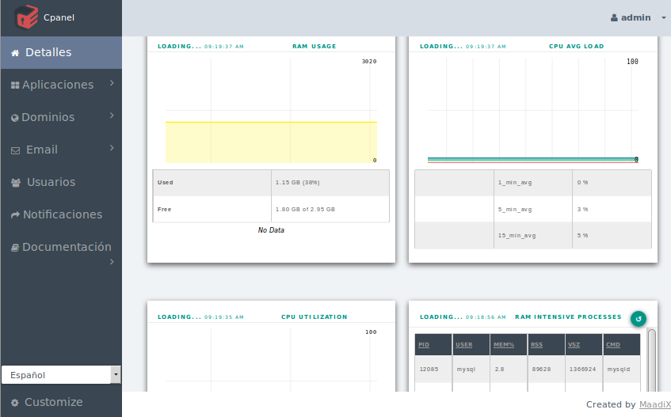

# Alta del servidor

Cuando el proceso de creación de una máquina virtual termina, el mismo servidor recién creado envía un email a la cuenta de correo electrónico que se ha designado como administrador.  

El mail contiene instrucciones sobre como acceder al servidor, incluyendo las contraseñas. Dichas contraseñas son generadas localmente por el servidor, y nadie más que él las conoce.  
Sin embargo (al menos de momento) el envío por email de las contraseñas se efectúa en texto plano, lo que hace absolutamente indispensable que se proceda cambiarlas. MaadiX fuerza al nuevo adinistrador a que cambie las contraseñas a través de un proceso de activación. 

# Activación 

La primera vez que se accede al Panel de Control solo se mostrará la página de activación. En esta página se tendrá que proceder al cambio de la contraseña de dos diferentes usuarios en el sistema:  

* El administrador del panel de control  
* El usuario root del sistema (Superusuario)    

Hasta que no se completa este proceso las otras secciones del Panel de Control no serán accesibles y el usuario root no podrá acceder al sistema ni por ssh ni por sftp. 

Esta es una importante medida de seguridad que tiene que ser aplicada también para cualquier otra aplicación que se haya instalado y que requiera un nombre de usuario y contraseña. 

Es muy importante que el correo electrónico asociado al Administrador del Panel de Control sea válido y que tengas acceso a él, ya que el servidor enviará a esta cuenta todas las notificaciones, indicaciones e las instrucciones para recuperar la clave de acceso al Panel de Control en caso de perdida.

# Escritorio

El panel de Control incluye una página que muestra estádisticas internas y usos de recursos en el sistema. 

Puedes consultarlas desde la pestaña 'Detalles', la primera en el menú izquierdo

