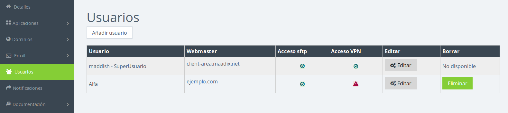
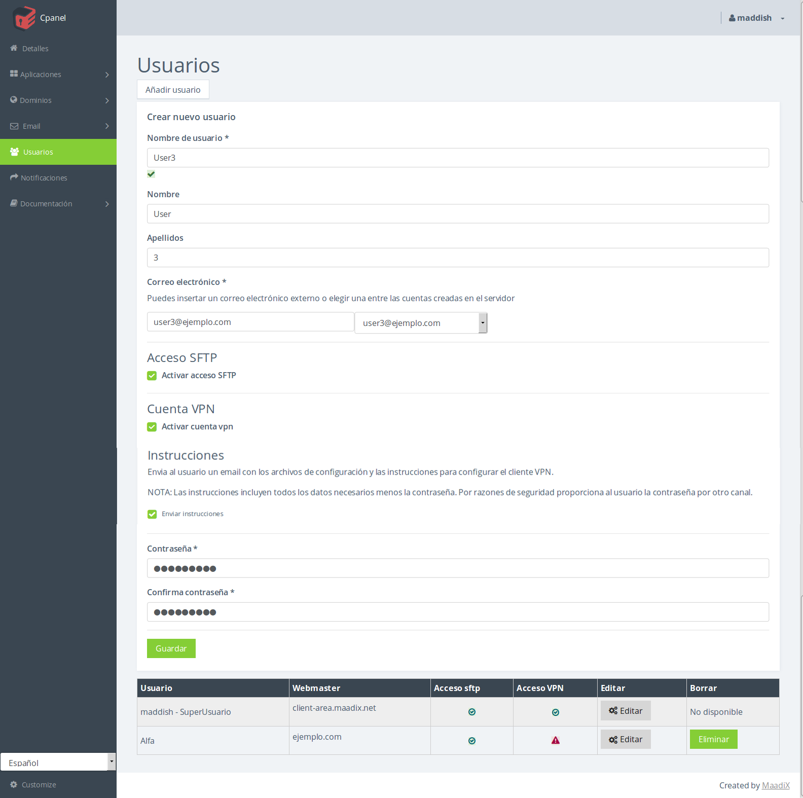

# Cómo crear y editar usuarios de sistema

MaadiX permite crear fácilmente, a través de tu Cpanel, usuarios de sistema con acceso SFTP/SSH a tu servidor. Estos usuarios de sistema tienen su propio espacio en tu servidor con ruta */home/sftpusers/usuario/*. Dentro de este espacio podrán crear y modificar archivos y carpteas. También ahí encontrarán el acceso directo a las carpetas de los dominios de los que sean Webmaster.

A diferencia del Superusuario, este tipo de usuario nunca podrá ver, acceder ni modificar el resto de carpetas y archivos del servidor más allá de su carpeta personal */home/usuario/* y de las carpetas de dominio de las que sea Webmaster.

## Crear un usuario nuevo

Haz click en la pestaña **Usuarios** de tu Cpanel. En este apartado puedes ver listados todos los usuarios de sistema actuales. Puedes ver cuales de ellos tienen acceso SFTP a su */home/sftpusers/usuario/* en tu servidor MaadiX, si tienen activado el servicio VPN y tus dominios propios de los que son Webmaster. El primer usuario de esta lista es siempre el SuperUsuario de sistema.

Haz click en le botón **Añadir Usuario** encima de la lista para desplegar el formulario. Los campos marcados con (\*) son obligatorios. Elige el nombre y contraseña para el nuevo usuario. Asígnale un correo electrónico, puedes elegir entre una de las cuentas de correo que hayas creado en MaadiX o una cuenta de correo externa.

### Acceso SFTP

Marcando la casilla **Acceso SFTP** se creará una carpeta para el nuevo usuario dentro de tu servidor MaadiX en la ruta */home/sftpusers/usuario/* a la cual tendrá acceso por SFTP con los creedenciales:

* **Servidor**: tu *subdomino.maadix.org*
* **Protocolo**: SFTP  
* **Modo de acceso**: Normal  
* **Usuario**: El nombre del usuario (sensible a mayúsculas/minúsculas)
* **Contraseña**: La contraseña que has establecido para este usuario

a través de un cliente SFTP como por ejemplo [Filezilla](https://filezilla-project.org/). Si quieres compartir estos credenciales de acceso deberás buscar un canal seguro para comunicarlos tú ya que por razones de seguridad MaadiX no las envirá.

### Cuenta VPN

Marcando la casilla **Cuenta VPN** darás acceso al nuevo usuario a utilizar la VPN de tu servidor MaadiX. Esto le permitirá conectarse a su espacio en el servidor utilizando una conexión cifrada y segura. Además de ello, podrá visitar cualquier dirección de Internet pasando primero a través de la VPN. Esto le permite navergar de manera más segura si, por ejemplo, está conectado a una red WiFi pública.

La VPN de MaddiX funciona con OpenVPN. Es necesario instalar en los dispositivos que vayan a utilizarla el software de OpenVPN y añadir ciertas configuraciones. Aquí puedes encontrar un tutorial sencillo para diferentes sistemas operativos (Linux / MacOX / Windows) y para PC o móvil: [Instrucciones para crear VPN](vpn)

Por defecto al crear la cuenta VPN para el nuevo usuario se le enviará un mail con estas instrucciones y los archivos de configuración preparados. Sin embargo, nuevamente la contraseña no se enviará por razones de seguridad y deberás hacersela llegar por otro canal. El usuario/contraseña es el mismo que el del acceso SFTP.

