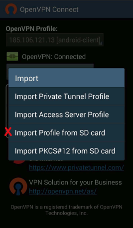
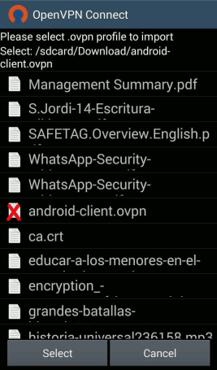
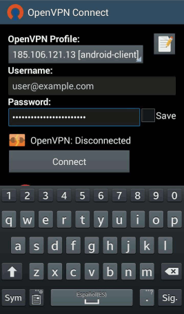
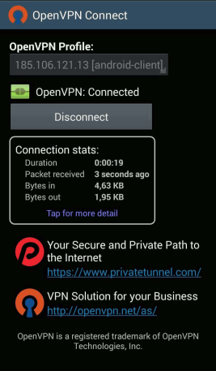

# VPN: Activar cuentas y configurar el cliente

Una red privada virtual o VPN ([Virtual Private Network - Wikipedia](https://es.wikipedia.org/wiki/Red_privada_virtual)) es una forma de proteger todo tu tráfico a través de una conexión cifrada, segura y directa a tu servidor, garantizando la confidencialidad de tu navegación incluso en las circunstancias más adversas (redes públicas o poco fiables).

La VPN de MaadiX te permite conectarte a tu servidor y gestionarlo utilizando en todo momento una conexión cifrada y segura. Además, también puedes visitar cualquier dirección de Internet canalizando tu tráfico a través del servidor, lo que te permite acceder a contenidos que podrían estar bloqueados en el país en el que te encuentras fisícamente.

Para empezar a usar la VPN de tu servidor de MaadiX debes llevar a cabo dos procesos:
* Crear o editar un usuario desde tu panel de control para darle acceso a la VPN
* Instalar un programa 'cliente' en el dispositivo que quieres conectar a través de la VPN

A continuación, se explican paso a paso ambas operaciones, sin las cuales no podrás disfrutar de las ventajas de una conexión mediante VPN.

# Crear o editar un usuario desde tu panel de control para darle acceso a la VPN

1. Estando en el panel de control, entra en la pestaña '**Usuarios**'. Puedes editar un usuario existente o bien crear uno nuevo.  

2. Entre las opciones disponibles dentro del panel de edición, verás '*Cuenta VPN*'. Marca la casilla correspondiente para activar la cuenta VPN para este usuario concreto.

3. Marca también la casilla '*Enviar instrucciones*' para enviar al usuario un correo electrónico con los archivos de configuración y las correspondientes instrucciones para la configuración del cliente VPN. Recuerda que las instrucciones incluyen todos los datos de configuración necesarios menos la contraseña, que por razones de seguridad debes proporcionar al usuario por otro canal.

# Instalar y configurar el cliente OpenVPN 

Para establecer una conexión VPN con el servidor necesitas una aplicación cliente, que en el caso de MaadiX es OpenVPN, siendo esta la solución de código abierto que puedes instalar en el servidor. A continuación, puedes encontrar un tutorial detallado para ordenadores con los sistemas operativos Windows o Linux, así como para móviles Android.

## Windows

1. Descarga e instala la aplicación OpenVPN desde [este enlace](https://openvpn.net/index.php/open-source/downloads.html)

2. Toma nota de la ubicación de la aplicación que acabas de descargar. Finalizado el proceso de instalación, copia en la carpeta \config los dos archivos dentro de la carpeta `/windows/` adjuntos en el correo electrónico que te notificó la activación de tu cuenta de VPN (\*). 

a) `vpn.ovpn`    
b) `ca.crt`  

Nota: La ubicación por defecto es `C:\Program Files\OpenVPN`, así que tendrás que copiar ambos archivos en `C:\Program Files\OpenVPN\config\`, a menos que durante la instalación hayas ubicado la aplicación en otra carpeta.

3. Abre la aplicación OpenVPN GUI. Es probable que se haya creado un acceso directo en el escritorio.

4. Introduce el usuario y contraseña enviados por el administrador para efectuar la conexión.

Espera unos segundos hasta que se establezca la conexión. Para comprobar que la conexión se ha efectuado con éxito, visita la web [http://cualesmiip.com/](http://cualesmiip.com/) activando y desactivando la VPN. El resultado que te ofrece como 'Tu IP real' debería ser distinto.

## Linux

1. Instala el cliente OpenVPN si no lo tienes instalado todavía (muchas distribuciones de Linux lo incluyen por defecto).   

Por consola:  

    sudo apt-get install network-manager-openvpn  
    sudo apt-get install network-manager-openvpn-gnome  

    sudo restart network-manager

Con el gestor de paquetes Synaptic:

Aplicaciones > Herramientas de Sistema > Gestor de paquetes Synaptic

Busca y selecciona network-manager-openvpn y network-manager-openvpn-gnome e instálalos.

2. Haz clic en 'Configuración de Red' desde el panel del Network Manager (el nombre puede ser también 'Preferencias de Red', 'Conexiones de Red' u otro, dependiendo de tu distribución de Linux).

3. Busca el botón 'Añadir' o simplemente '+' para añadir la nueva configuración y elige la opción VPN/OpenVPN.

4. Escoge la opción 'Importar desde un archivo'.

5. Selecciona el archivo vpn.conf dentro de la carpeta `/linux/`, que te ha llegado por correo cuando se activó tu cuenta de VPN (\*).

6. Introduce el usuario y contraseña para llevar a cabo la conexión. Elige el método de gestión de la contraseña que prefieras (es aconsejable la opción 'Preguntar siempre').

 

7. Vuelve al Network Manager para activar la conexión recién creada.

 

Espera unos segundos hasta que se establezca la conexión. Para comprobar que la conexión se ha efectuado con éxito, visita la web [http://cualesmiip.com/](http://cualesmiip.com/) primero con la VPN activada y luego desactivada. El resultado que te ofrece como 'Tu IP real' debería ser distinto.

## Android

1. Extrae y guarda en tu dispositivo (tarjeta SD o almacenamiento interno) los archivos de configuración de la VPN que te llegado por correo electrónico (\*). 

2. Descarga en Google Play o F-Droid la App **OpenVpn Connect**.

[Descargar OpenVpn Connect desde GooglePlay](https://play.google.com/store/apps/details?id=net.openvpn.openvpn&hl=es)  
[Descargar OpenVpn Connect desde F-Droid](https://f-droid.org/app/de.blinkt.openvpn)  

3. Abre la aplicación. En el menú, elige la opción 'Import'.

4. Selecciona la opción 'Import profile from SD card' (Esta opción es válida aunque no tengas una tarjeta SD. En este caso, búscalo en el almacenamiento interno de tu teléfono).

5. Localiza y selecciona en tu tarjeta SD el archivo de configuración descargado anteriormente y con ruta `/VPN-(direcciónIP)/android/android-client.ovpn`. En esta carpeta encontrarás también un archivo llamado ca.crt, que debe permanecer allí para que el cliente VPN se configure correctamente.

6. Introduce el usuario y la contraseña para llevar a cabo la conexión.

Espera unos segundos hasta que se establezca la conexión. Para comprobar que la conexión se ha efectuado con éxito, visita la web [http://cualesmiip.com/](http://cualesmiip.com/) primero con la VPN activada y luego desactivada. El resultado que te ofrece como 'Tu IP real' debería ser distinto.

-----

(\*): Cuando el administrador activa una cuenta VPN desde el panel de control, puede elegir la opción de enviar un correo con instrucciones para instalar el cliente VPN y los archivos de configuración necesarios para diferentes sistemas operativos. En caso de que el usuario de la cuenta VPN no hubiera recibido este correo con archivos e instrucciones, debe solicitarlo de nuevo al administrador. El administrador puede reenviarlo en cualquier momento desde el panel de edición del usuario en concreto.
