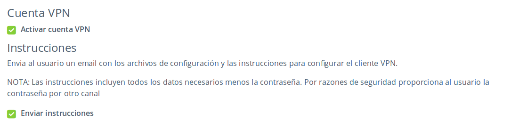
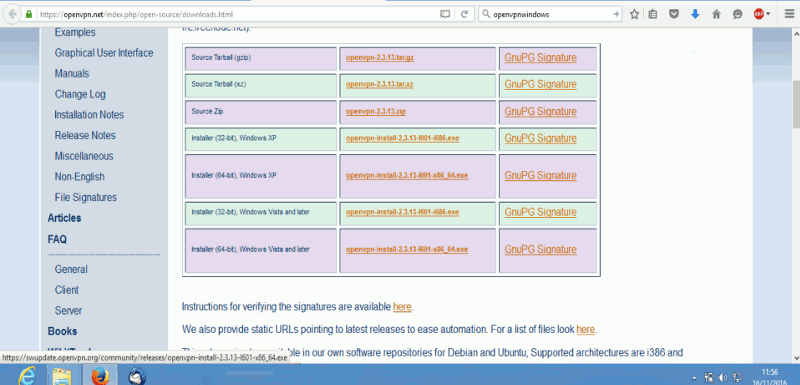
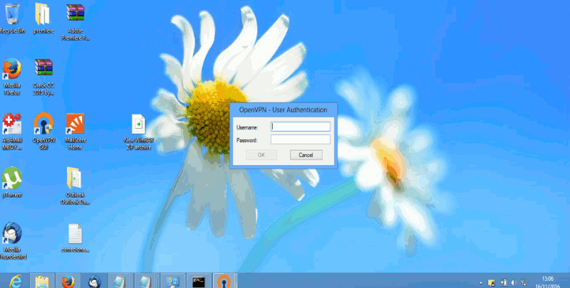
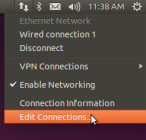
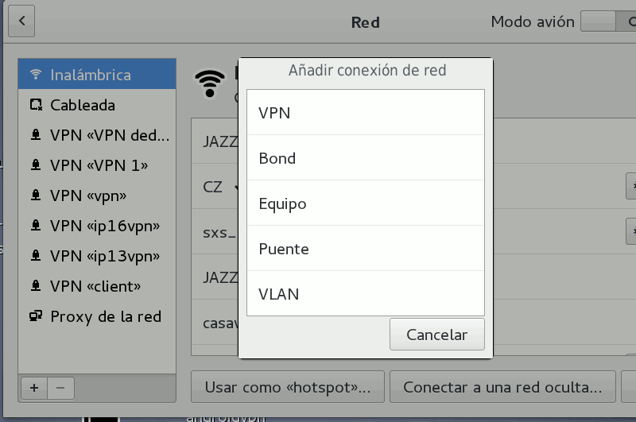
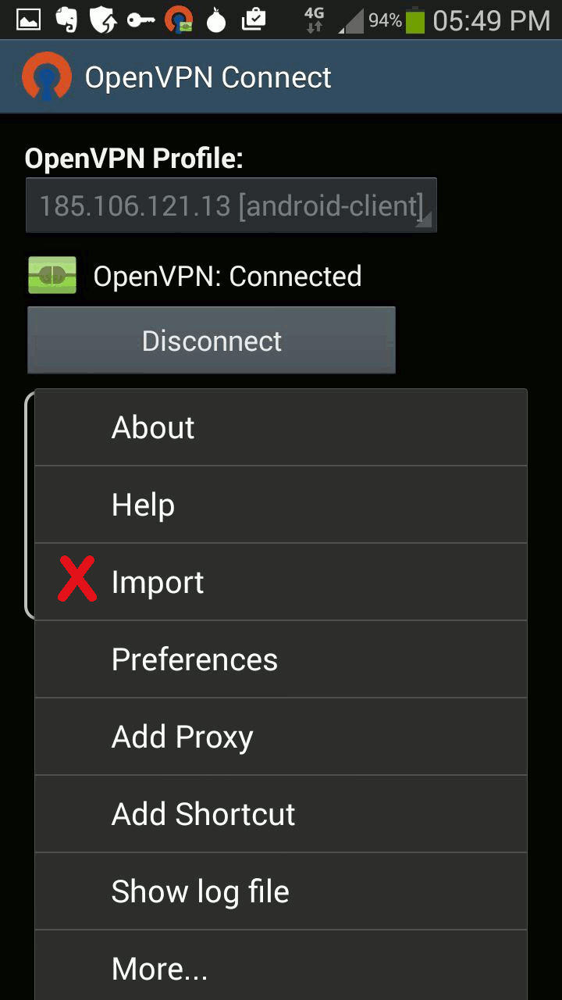
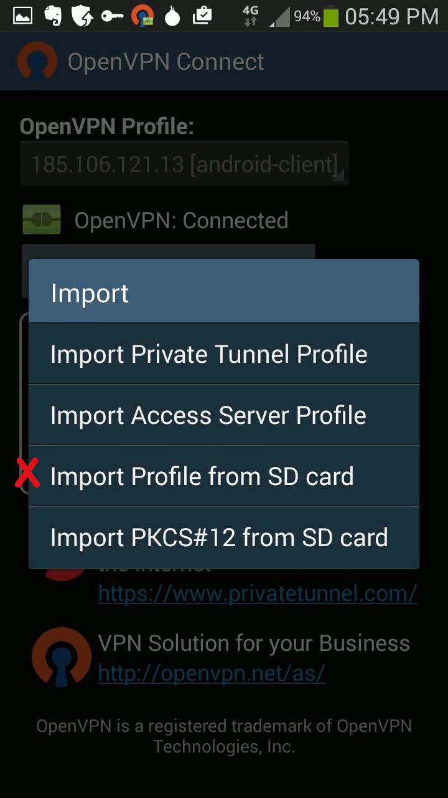
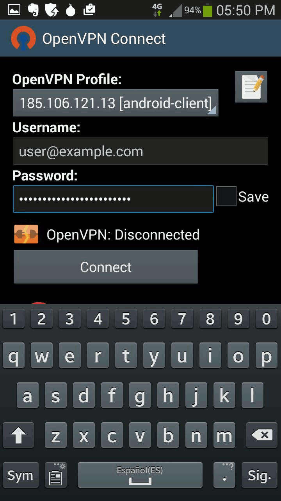

# VPN: activar cuentas y configurar el cliente

Una red privada virtual o VPN ([Virtual Private Network - Wikipedia](https://es.wikipedia.org/wiki/Red_privada_virtual)) es una tecnología de red que permite una extensión segura de tu red privada de área local (LAN) a través de una red pública sobre la que no tienes control como Internet.

La VPN de MaadiX te permite conectarte a tu servidor y gestionarlo utilizando una conexión cifrada y segura. Además de ello, puedes visitar cualquier dirección de Internet pasando primero a través de tu VPN. Esto te permite navegar de manera más segura si, por ejemplo, estás conectado a una red WiFi pública. 
  
Para empezar a usar la VPN de tu servidor debes llevar a cabo dos procesos:
* Crear o editar un usuario desde tu Cpanel para darle acceso a la VPN
* Instalar un programa 'cliente' en el dispositivo que quieres conectar a través de la VPN

# Crear o editar un usuario desde tu Cpanel para darle acceso a la VPN

1- Desde el Cpanel entra en la pestaña '**Usuarios**'. Puedes editar un usuario existente o crear uno nuevo.  

2- Entre los atributos disponibles verás '*Cuenta VPN*'. Marca esa casilla para activar la cuenta VPN para este usuario.  

3- Marca la casilla '*Enviar instrucciones*' para enviar al usuario un email con los archivos de configuración y las instrucciones para configurar el cliente VPN (nota: las instrucciones incluyen todos los datos necesarios menos la contraseña. Por razones de seguridad, proporciona al usuario la contraseña por otro canal).

# Instalar y configurar cliente OpenVPN 

La VPN de MaddiX funciona con OpenVPN. Es necesario instalar en los dispositivos que vayan a utilizarla el software de OpenVPN y añadir ciertas configuraciones. A continuación puedes encontrar un tutorial sencillo para PCs con sistema operativo Linux  y Windows y para móviles Android:

## Windows

1- Descarga e instalar la aplicación OpenVpn.

https://openvpn.net/index.php/open-source/downloads.html  

2- Toma nota de la ubicación de la aplicación. Una vez acabada la instalación, copia en la carpeta \config los dos archivos dentro de la carpeta `/windows/` que deben haberte llegado por correo cuando se activó tu cuenta de VPN (\*). 

a) `vpn.ovpn`    
b) `ca.crt`  

NOTA: La ubicación por defecto es `C:\Program Files\OpenVPN`, así que tendrás que copiar ambos archivos en `C:\Program Files\OpenVPN\config\` a menos que durante la instalación hayas ubicado la aplicación en otra carpeta.

3- Abre la aplicación OpenVPN GUI. Posiblemente se haya creado un acceso directo en tu escritorio.

4- Introduce el usuario y contraseña que debe haber proporcionado el administrador para la conexión.

Espera unos segundos hasta que se establezca la conexión. Para comprobar que la conexión se ha efectuado con éxito visita la web [http://cualesmiip.com/](http://cualesmiip.com/) activando y desactivando la VPN.  El resultado que te ofrece como 'Tu IP real' debería ser distinto.

## Linux

1- Instala el cliente OpenVpn si no lo tienes instalado todavía (muchas distribuciones de linux lo incluyen por defecto).   

Por consola:  

    sudo apt-get install network-manager-openvpn  
    sudo apt-get install network-manager-openvpn-gnome  

    sudo restart network-manager

Con Synaptic:

Aplicaciones > Herramientas de Sistema > Gestor de paquetes Synaptic

Busca y selecciona netwotk-manager-openvpn  e instalalo.

2- Haz click en 'Configuración de Red' desde el panel de Network Manager (el nombre puede ser tambié 'Preferencias de Red', 'Conexiones de Red' y otro según la distribución de linux).

3- Busca el botón 'Añadir' o '+' para  añadir la configuración y elige la opción VPN/OpenVPN.

4- Escoge la opción 'Importar desde un archivo'.

5- Importa el archivo vpn.conf dentro de la carpeta `/linux/` que debe haberte llegado por correo cuando se activó tu cuenta de VPN (\*).

6- Introduce el usuario y contraseña para tu conexión que el administrador debe haberte comunicado por un canal seguro. Por razones de seguridad la contraseña no se envía junto al mail de instrucciones. Elije el método de gestión de la contraseña (es aconsejable la opción 'Preguntar siempre').

 

7- Vuelve al panel del Network Manager y activa la conexión recién creada.

 

En unos segundos se crea la conexión. Para comprobar que la conexión se ha efectuado con éxito visita la web [http://cualesmiip.com/](http://cualesmiip.com/) activando y desactivando la VPN.  El resultado que te ofrece como 'Tu IP real' debería ser distinto.  

## Android

1- Extrae y guarda en tu tarjeta SD los archivos de configuración que se te habrán enviado por correo al crearte la cuenta VPN (\*). 

2- Descarga la App **OpenVpn Connect** para Android. 

[Descargar OpenVpn Connect desde GooglePlay](https://play.google.com/store/apps/details?id=net.openvpn.openvpn&hl=es)
[Descargar OpenVpn Connect desde F-Droid](https://f-droid.org/app/de.blinkt.openvpn)

3- Lanza la aplicación. En el menú el menú escoge la opción 'Import'.  

4- Selecciona 'Import profile from SD card'.  

4- Localiza y selecciona en tu tarjeta SD el archivo de configuración descargado anteriormente y con ruta `/VPN-(direcciónIP)/android/android-client.ovpn`. En esta carpeta encontrarás también un archivo ca.crt que debe estar ahí para que se configure correctamente el cliente VPN.

5- Introduce el usuario y contraseña para tu conexión que el administrador debe haberte comunicado por un canal seguro. Por razones de seguridad la contraseña no se envía junto al mail de instrucciones

6- Espera unos segundos hasta que se establezca la conexión.

la conexión se ha efectuado con éxito visita la web [http://cualesmiip.com/](http://cualesmiip.com/) activando y desactivando la VPN.  El resultado que te ofrece como 'Tu IP real' debería ser distinto.

-----

(\*) Cuando el administrador activa una cuenta VPN desde el Cpanel puede enviar un mail con instrucciones para instalar el cliente VPN y los archivos de configuración de configuración necesarios para diferentes sistemas operativos. Si por alguna razón el usuario de la cuenta VPN no ha recibido este mail con estas instrucciones y archivos, debe solicitarlo de nuevo al administrador. El administrador puede reenviarlo en cualquier momento desde el panel de edición del usuario en concreto.
