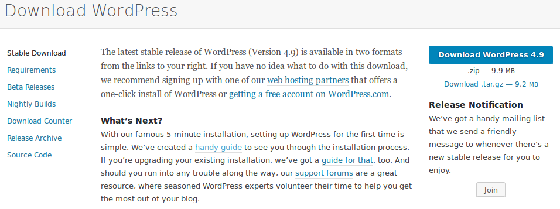
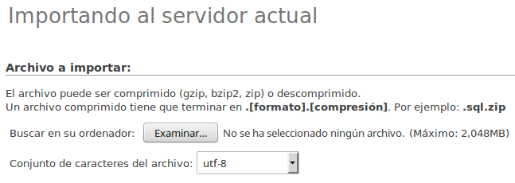
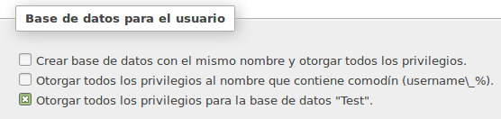
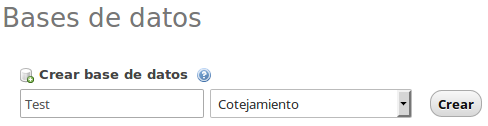
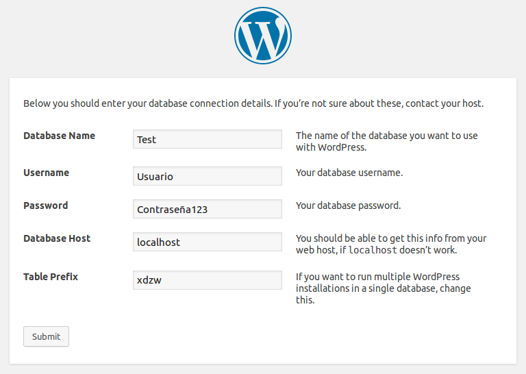
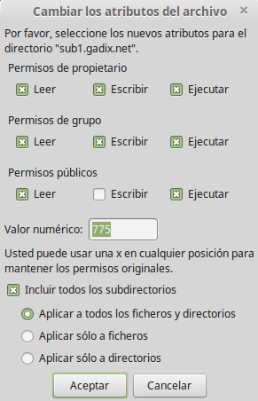

# Instalar WordPress

1. Descarga la aplicación desde la [página oficial](https://wordpress.org/download/).

Descomprime la carpeta.

2. Sube al servidor los archivos de la carpeta "wordpress", dentro de la carpeta del dominio que se ha generado al activar el dominio desde el panel del control. Si has añadido el dominio example.com, la carpeta será `/var/www/html/example.com/`.

Para hacerlo, puedes utilizar un cliente SFTP como Filezilla.
Advertencia: No debes subir la carpeta "wordpress" como tal, únicamente los archivos que contiene.

3. Crea la base de datos

Para crear una base de datos, puedes utilizar la aplicación phpMyAdmin.

## Importar una base de datos existente

En caso de que ya tengas una base de datos MySQL de tu WordPress (por ejemplo, en casos de migración desde otro servidor), es necesario importarla. Desde phpMyAdmin, tienes que seleccionar el apartado "Importar"  y subir el archivo que corresponda (.sql o .gzip, .bzip2 o .zip en el caso esté comprimida).

Una vez importada, tenemos que seleccionar el apartado "Privilegios" para crear un nuevo usuario que pueda acceder a la base de datos, leer y escribir en ella (se desaconseja usar el mismo usuario root por razones de seguridad).

Elige un nombre y una contraseña y haz clic en "Otorgar todos los privilegios para la base de datos".
Apunta el nombre de usuario y la contraseña del usuario MySQL que acabas de crear, puesto que serán necesarios durante el proceso de instalación de WordPress.

## Crear una nueva base de datos

Si se trata de una nueva instalación y todavía no tenemos creada una base de datos MySQL, es preciso crear una. Dentro de phpMyAdmin, tenemos que ir a "Bases de datos" > "Crear base de datos".

Una vez creada, tenemos que seleccionar el apartado "Privilegios" para crear un nuevo usuario que que pueda acceder a la base de datos, leer y escribir en ella (se desaconseja usar el mismo usuario root por razones de seguridad).

Elige un nombre y una contraseña y haz clic en "Otorgar todos los privilegios para la base de datos".
Apunta el nombre de usuario y la contraseña del usuario MySQL que acabas de crear, puesto que serán necesarios durante el proceso de instalación de WordPress.

## Configurar WordPress

Cuando tengamos creada la base de datos, tenemos que visitar el dominio con el navegador. Aparecerá un formulario para finalizar el proceso de instalación de WordPress, en el que se solicitarán las credenciales del usuario MySQL que hemos creado.

Recuerda que cambiar el prefijo wp_ por otro en el apartado "Table Prefix" añade una capa de seguridad adicional a tu instalación.

# Problemas frecuentes en la instalación de WordPress

## No puedo instalar plugins ni introducir imágenes

Asegúrate de que los permisos de los archivos que has subido por SFTP sean los correctos. Para que WordPress pueda subir imágenes y plugins desde el panel de administración, la carpeta /var/www/html/example.com/wp-content tiene que tener los siguientes permisos:

`drwxrwsr-x`

Para comprobar que los permisos sean correctos, desde FileZilla debes hacer clic con el botón derecho encima de la carpeta wp-content y seleccionar la opción "Permisos de archivo" o "Atributos de archivo", según tu versión.

Los permisos tienen que quedar de esta manera, siendo el valor numérico 775. También tienes que marcar la opción "Activar a todos los ficheros y directorios".

--

A pesar de que los permisos de las carpetas del WordPress sean los correctos, podrías tener problemas a la hora de instalar plugins o subir imágenes. Para solucionarlo, añade la siguiente línea al final del archivo wp-config.php:

  `define( 'FS_METHOD', 'direct' );`.

Cuando subes imágenes o plugins desde WordPress, en lugar que desde un cliente SFTP, quién ejecuta la operación no es tu propio usuario, sino el usuario de Apache (www-data).
A pesar de que este usuario tenga permisos de escritura sobre los archivos, no es el propietario.
En servidores compartidos, esto podría representar un problema de seguridad, ya que el mismo usuario www-data podría estar siendo utilizado por todas las personas que tengan acceso.
Por ello, WordPress utiliza un método en el que comprueba (además de los permisos) si el propietario de los archivos coincide con el usuario que está cumpliendo la operación de escritura -- situación que no se da, por lo que no sigue con la operación y te solicita las credenciales FTP.

En MaadiX no tienes FTP ni FTPs, únicamente SFTP , que utiliza el puerto 22 en lugar del 21, que es el que utiliza WordPress sin darte la opción de cambiarlo.
La solución de definir el método como 'direct' hace que WordPress acceda de forma directa al sistema de archivos, en el que el usuario www-data tiene los permisos necesarios para escribir.

Si quieres saber más, puedes consultar estos dos enlaces:
https://wordpress.stackexchange.com/questions/189554/what-security-concerns-should-i-have-when-setting-fs-method-to-direct-in-wp-co
https://wordpress.stackexchange.com/a/232291
